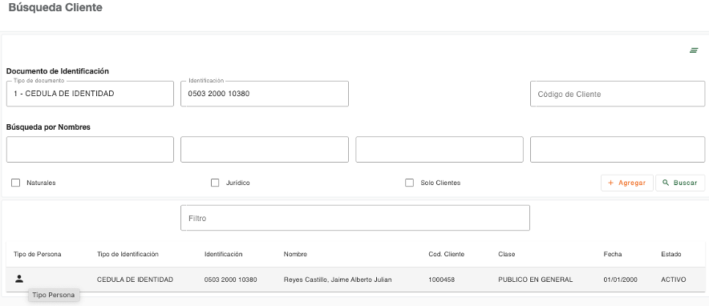

# Administrar Persona

La opción de Administrar Persona permite gestionar la información de los clientes de forma centralizada, tanto para personas naturales o jurídicas. Las secciones (tabs) que se habilitan pueden ser diferentes, dependiendo del tipo de persona y los datos con los que están registradas en el sistema.

La documentación de los datos que son capturados en cada sección ha sido descrita en el detalle de cada paso del flujo para creación de clientes (Natural/Jurídico), consultar el detalle en el paso correspondiente.

El gestor para administrar persona se ejecuta desde la búsqueda de clientes, al seleccionar una persona que ya es cliente o también se puede redireccionar a esta opción, al finalizar de crear un cliente.

Al ingresar al gestor para administrar persona, se muestra por defecto la sección de mensajes relacionados a la gestión de la persona.

A continuación, se describe de forma general cada una de las secciones que pueden ser utilizadas en el gestor. Al ingresar a cada sección el sistema valida los permisos que tiene el usuario para gestionar la información del cliente.

* [Mensajes](mensaje.md)
* [Datos Generales](datos_generales.md)
* [Direcciones](direcciones.md)
* [Contacto](contacto.md)
* [Referencias](referencias.md)
* [Referencias Laborales](referencias_laborales.md)
* [Perfil Económico](perfil_economico.md)
* [PEP](pep.md)
* [Cónyuge](conyuge.md)
* [Dependencia Económica](dependecias_economica.md)
* [FATCA](fatca.md)
* [Digitalización de Documentos](digitalizacion_documentos.md)
* [Cambio de Nombre](cambio_nombre.md)
* [Cambio de Identificaciones](cambio_identificaciones.md)
* [Impresión](impresion.md)
* [Relaciones PEP](relaciones_pep.md)
* [Dependientes](dependientes.md)
* [Representante Legal](representante_legal.md)
* [Accionistas](accionistas.md)
* [Junta Directiva](junta_directiva.md)
* [Perfil de Consulta del Cliente](perfil_consulta_cliente.md)
* [Datos Biométricos](datos_biometricos.md)

[← Volver a Menú plataforma](../index.md)

