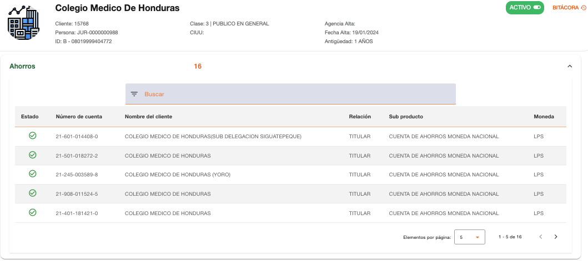
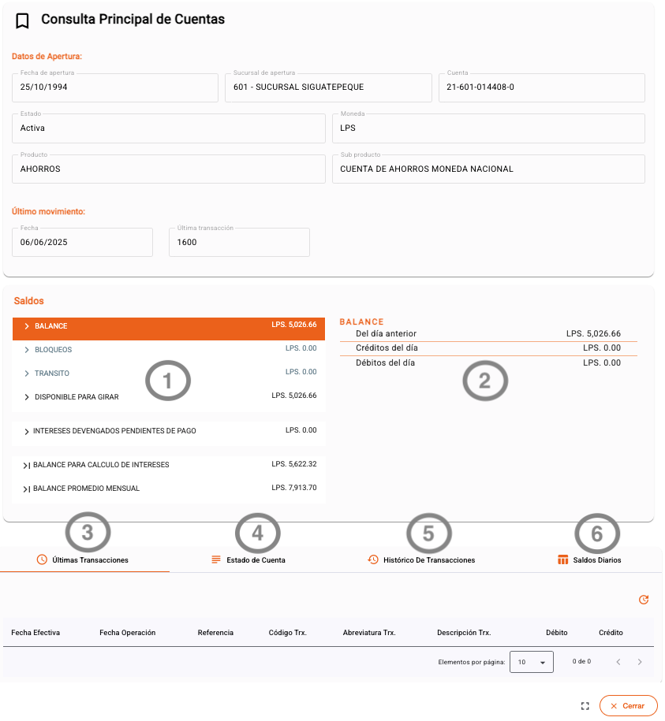

# Ahorros

Información de los recursos monetarios que el cliente posee en cuentas de ahorros de la institución.

Al seleccionar una de las cuentas de esta sección, se puede consultar la información general de la cuenta y el detalle de los movimientos monetarios realizados:

1.  **Desglose de los saldos**
2.  **Detalle de distribución de saldo**
3.  **Últimas transacciones**
4.  **Estado de cuenta**
5.  **Histórico de transacciones**
6.  **Saldos diarios**

Al seleccionar cada línea de **desglose de los saldos (1)**, se muestra el **detalle de distribución del saldo (2)** y en cada línea de la distribución de saldos se puede consultar el detalle de movimientos.

> **Nota:** Las cuentas de ahorro cuentan con las mismas opciones de consulta (Últimas transacciones, Estado de cuenta, Histórico y Saldos diarios) descritas detalladamente en la sección de [Cuentas de Cheques](cheques.md).

[← Volver a página anterior](captaciones.md)

