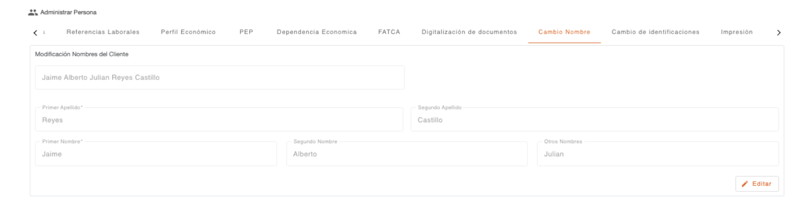
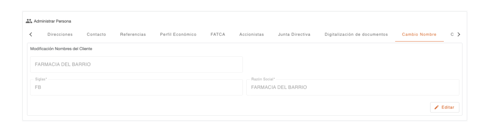

# Cambio de Nombre

Esta sección permite realizar correcciones o cambios en el nombre de las personas (Natural o Jurídica). Durante esta operación, el sistema valida automáticamente los nombres e identificaciones en las **listas de cautela**. Dependiendo del hallazgo, el sistema puede:
* Mostrar una notificación informativa.
* Solicitar una autorización.
* Detener completamente la operación.

Al utilizar el botón **Editar**, se habilitan los campos relacionados con los nombres. Tenga en cuenta que estos campos varían según el tipo de persona (Natural o Jurídica). Para guardar los cambios, el sistema solicitará las credenciales necesarias para autorizar la modificación.

[← Volver a página anterior](administrar-persona.md)

