# Cheques

Información de los recursos monetarios que el cliente posee en cuentas de cheques de la institución.

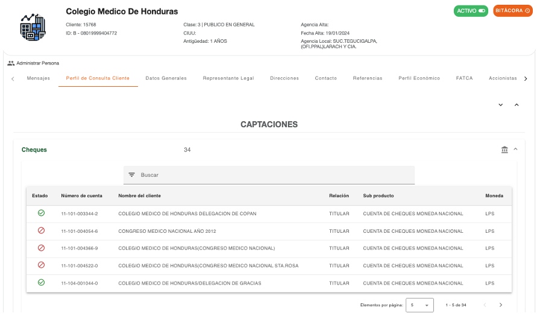

Al seleccionar una de las cuentas de esta sección, se puede consultar la información general de la cuenta y el detalle de los movimientos monetarios realizados:

1.  **Desglose de los saldos**
2.  **Detalle de distribución de saldo**
3.  **Últimas transacciones**
4.  **Estado de cuenta**
5.  **Histórico de transacciones**
6.  **Saldos diarios**

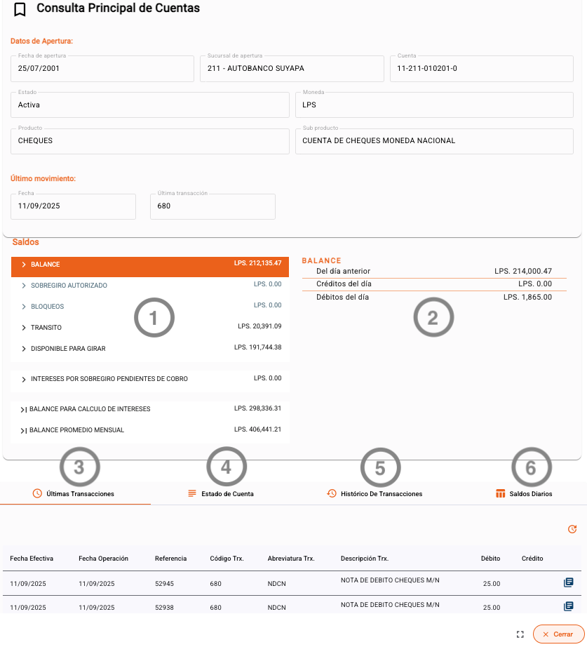

Al seleccionar cada línea de **desglose de los saldos (1)**, se muestra el **detalle de distribución del saldo (2)** y en cada línea de la distribución de saldos se puede consultar el detalle de movimientos.

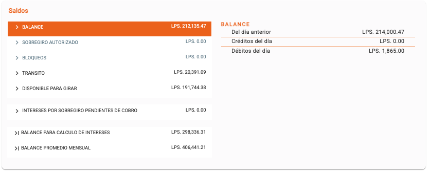

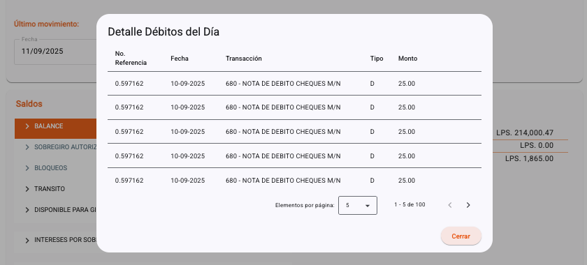

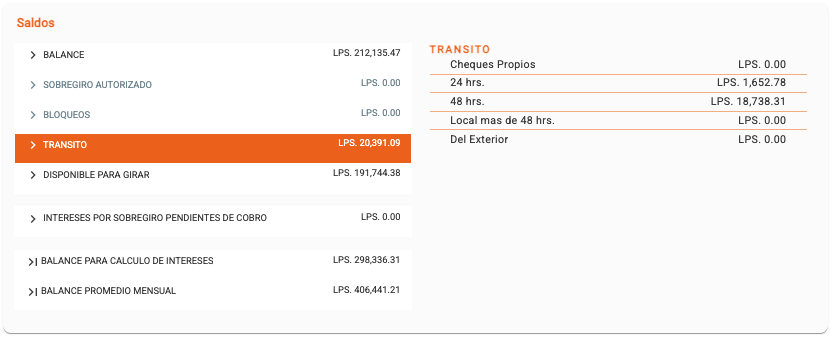

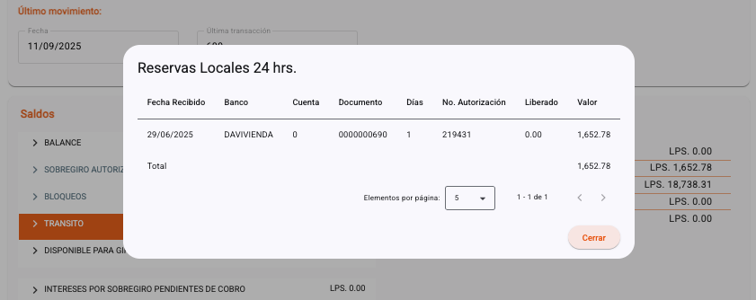

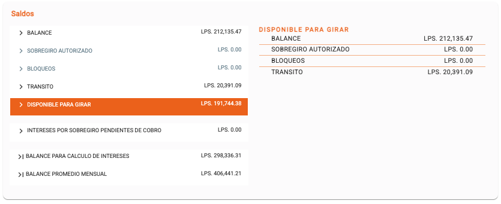

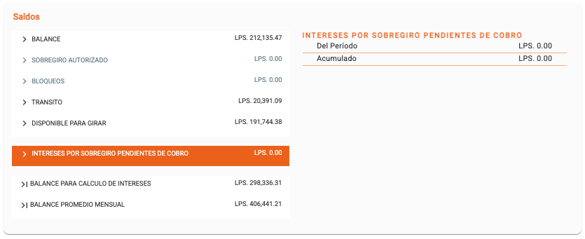

### Últimas Transacciones (3)

Muestra el listado de las últimas transacciones que han sido realizadas en la cuenta. Cada transacción se puede consultar a detalle seleccionando el icono ubicado al final de cada registro.

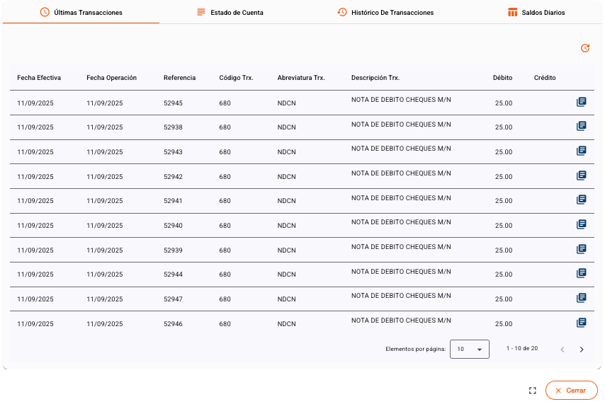

### Estado de Cuenta (4)

Muestra las transacciones que han sido realizadas en la cuenta durante un mes específico. Cada transacción se puede consultar a detalle seleccionando el icono ubicado al final de cada registro.

En la parte inferior se puede observar el acumulado de créditos y débitos, tanto en cantidades como totales que fueron realizados en el mes.

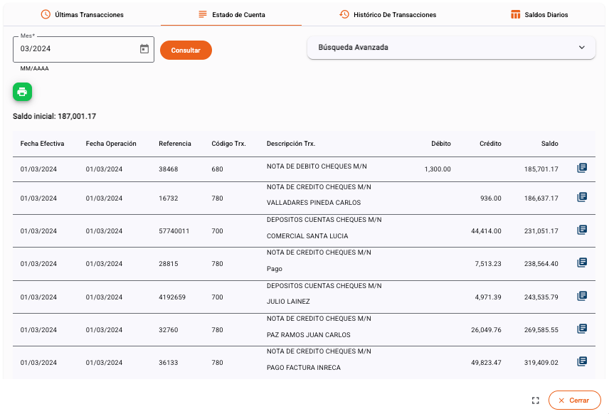

### Histórico de Transacciones (5)

Muestra el historial de transacciones realizadas en la cuenta durante un rango de fechas. Cada transacción se puede consultar a detalle seleccionando el icono ubicado al final de cada registro.

La opción de **Búsqueda Avanzada** permite realizar búsqueda de transacciones por medio de rangos de referencia o montos.

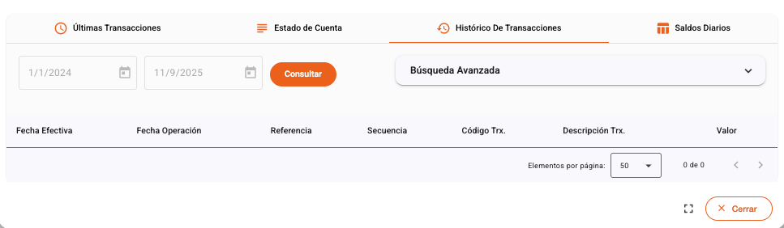

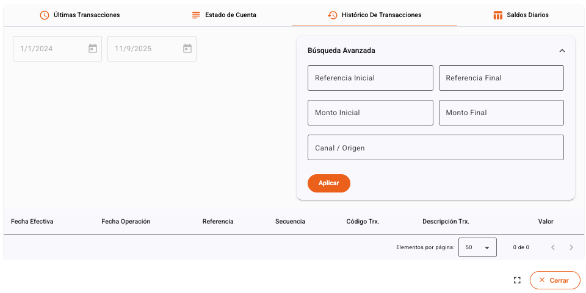

### Saldos Diarios (6)

Muestra el histórico de saldos diarios que fueron acumulados en un mes específico. Cada saldo se puede consultar a detalle seleccionando el día. Permite la navegación por cada mes o ubicarse en el mes actual.

En la parte inferior se puede observar el acumulado de saldos en el mes.

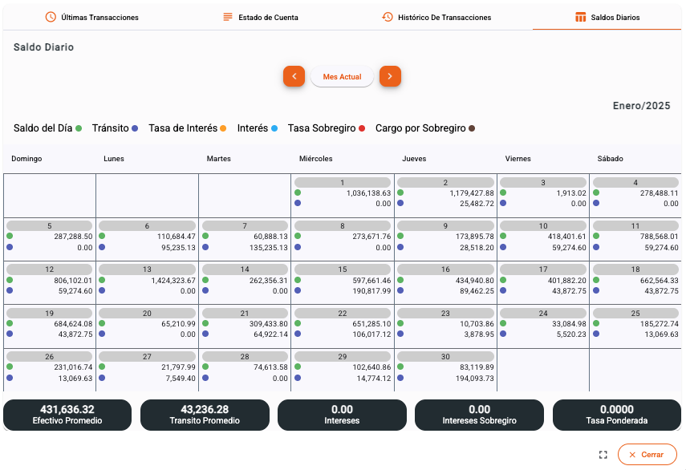

[← Volver a página anterior](captaciones.md)

