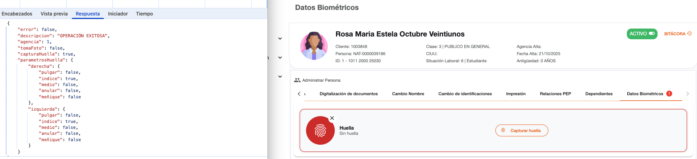
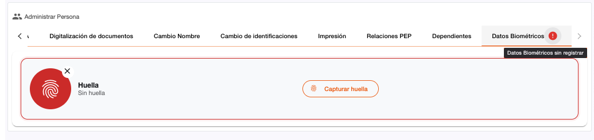
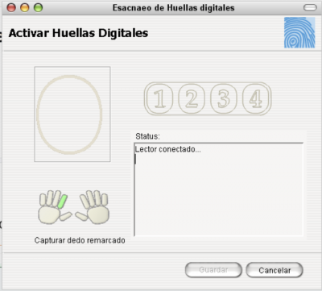
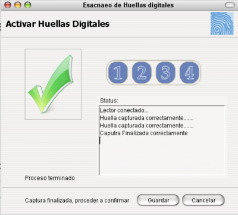
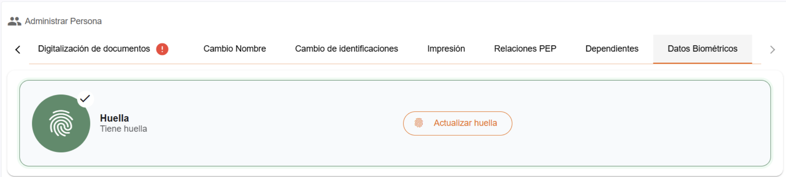
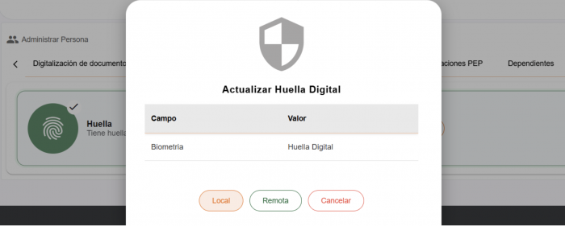

# Datos Biométricos

Permite gestionar los datos biométricos de una persona, permitiendo capturar las huellas en forma digital. Esta sección depende de los parámetros recuperados del core, en donde se indica si es permitido realizar la captura de huellas (capturaHuella). Esta opción esta disponible solo para personas naturales.

Dependiendo de la configuración de parámetros para captura de huella en el core, será necesario la captura de determinados dedos tanto de la mano derecha como la izquierda.

**Requerimientos**

* Dispositivo de lector de huella instalado con sus drivers correspondientes.
* Agente de captura de huella (applet)

---

## Agregar Huella

Cuando las huellas no han sido capturadas, se muestra al imagen de huella en rojo con el texto “Sin Huella” y un texto informativo en el tab de Datos Biométricos “Datos Biométricos sin registrar ”. Para realizar la captura de huellas se debe utilizar el botón “Capturar Huella”.

Al seleccionar “Capturar Huella” se activa el applet mostrando una pequeña ventana con la imagen de las manos, resaltando de color verde los dedos a los cuales corresponden las huellas que serán capturadas y un contador numeral de las veces que debe ser capturada la huella de cada dedo (1 2 3 4). 

En el campo “Status” se debe mostrar el texto “Lector Conectado…” el cual indica que el applet a detectado el dispositivo para capturar las huellas.

Al capturar cada huella de forma satisfactoria, en el campo “Status” será mostrado el texto “Huella capturada correctamente…” y al finalizar de capturar la huellas requeridas, se muestra el texto “Captura Finalizada correctamente”, se debe utilizar el botón Guardar para almacenar las huellas capturadas.

---

## Huella Registrada / Actualizar Huella

Cuando las huellas ya han sido capturadas, se muestra la imagen de huella en verde con el texto “Tiene Huella”.

Si fuera necesario cambiar o volver a capturar las huellas de una persona, se puede utilizar el botón “Actualizar Huella”. Para realizar la actualización de huellas, es mostrado el dialogo de autorizaciones, para que sea realizada la operación es necesario ingresar de forma local las credenciales del usuario que tiene permisos o hacer la solicitud de forma remota. Después que sea autorizado, se muestra la ventana pequeña del applet para captura de huellas, como se hace al agregar huellas.

---

### Mensajes de error

| Mensaje | Descripción |
| :--- | :--- |
| **Timeout - No se registro en lector** | Cuando el applet de captura de huella no esta listo para capturar huellas. |
| **Huella digital cancelada** | Cuando en la captura de huellas se utiliza el botón “Cancelar” |

[← Volver a página anterior](administrar-persona.md)

