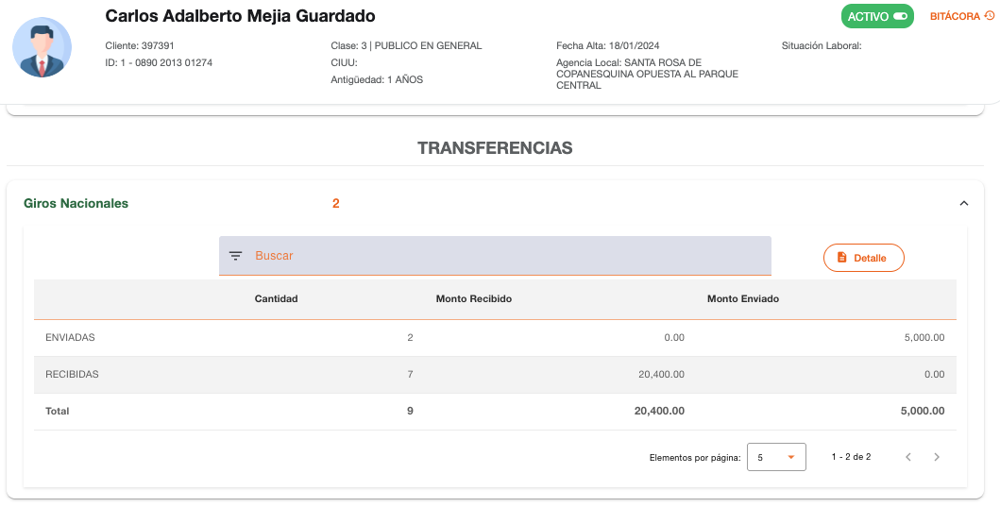
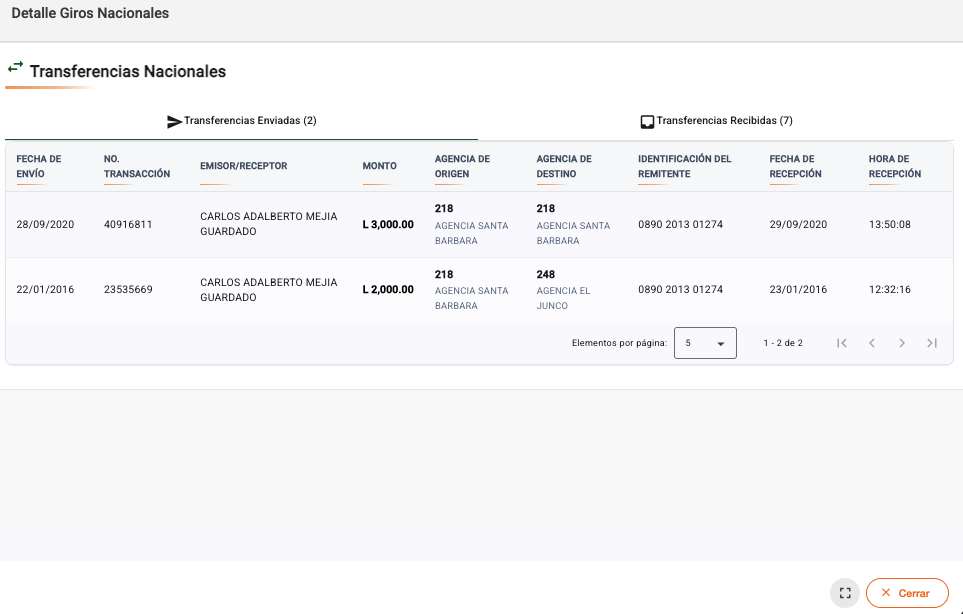

# Giros Nacionales

Información de los giros nacionales que han sido registrados en el sistema, ya sea enviados o recibidos por la persona.

La opción Detalle permite consultar la información de cada giro nacional, en una sección se muestran solo las transferencias enviadas y en otra sección solo las transferencias recibidas.

[← Volver a página anterior](transferencias.md)

