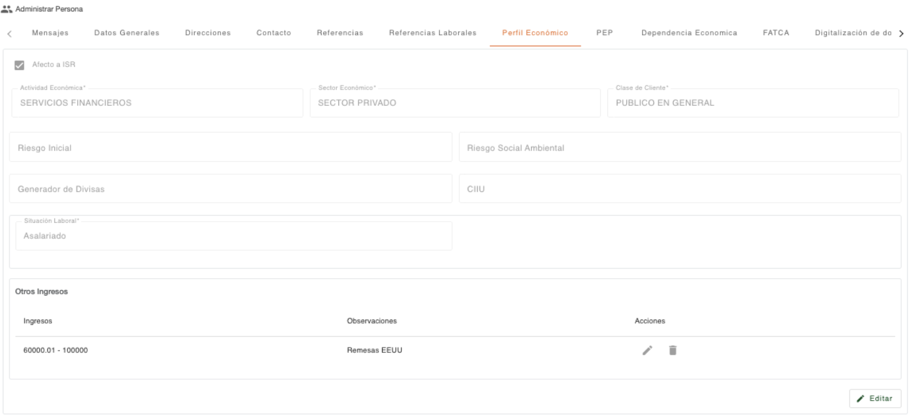
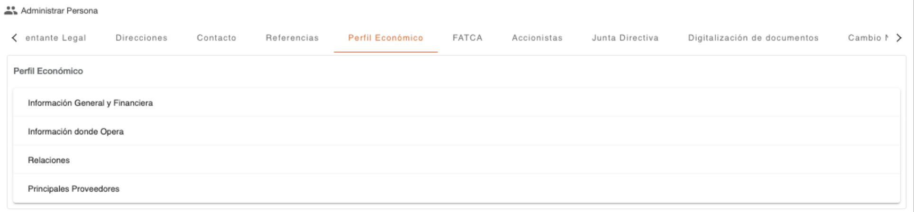
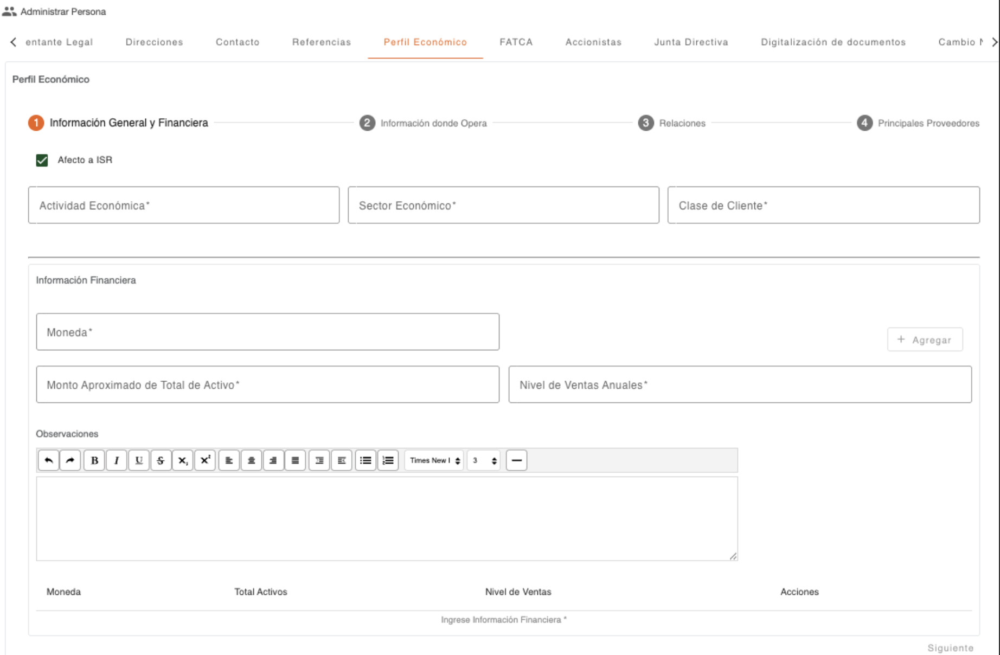

# Perfil Económico

Permite realizar consulta y edición de los datos de perfil económico de una persona (Natural o Jurídica). 

Al utilizar la opción **Editar**, se habilitan los campos que pueden ser modificados. Es importante considerar que los datos son diferentes dependiendo del tipo de persona (Natural/Jurídica) que sea el cliente. Para guardar los cambios realizados, serán solicitadas las credenciales que autorizan la modificación de los datos del cliente.

Al editar los campos **Riesgo Inicial**, **Riesgo Social Ambiental**, **Generador de Divisas** y **CIIU**, estos se pueden mostrar protegidos si el usuario no tiene los permisos necesarios para editar cada campo.

En el caso del perfil económico para una **persona jurídica**, el sistema cuenta con más secciones. Cuando ya existen datos, se pueden consultar o actualizar al seleccionar cada sección; si no existen, se muestran los pasos para agregar los datos. 

[← Volver a página anterior](administrar-persona.md)

