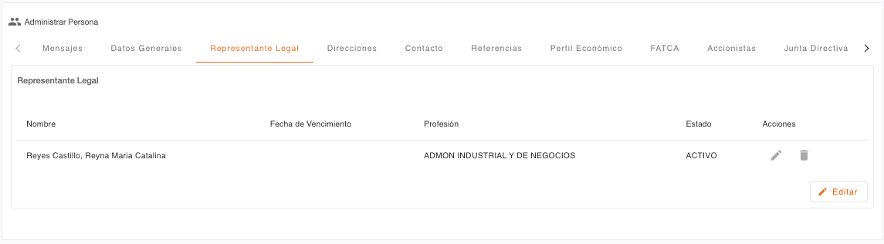
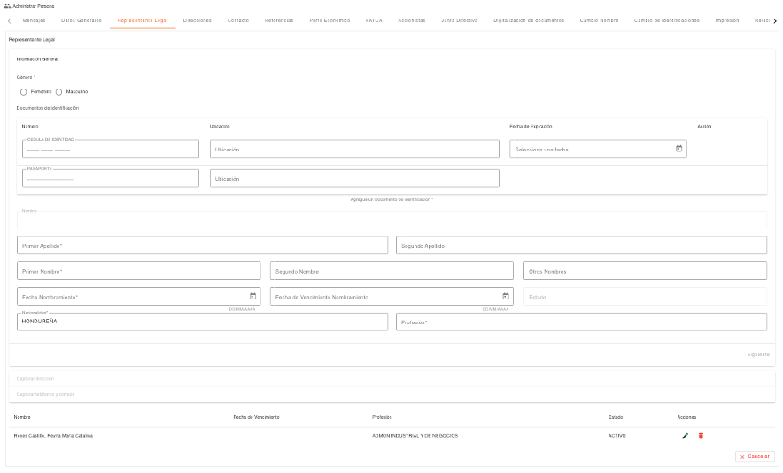

# Representante Legal

Permite realizar la consulta y edición de los datos de representantes legales registrados a una persona (Jurídica). Es importante destacar que solo puede existir un representante legal activo a la vez; al agregar un nuevo registro, el sistema inactiva automáticamente al representante que estuviera activo previamente.

Al utilizar el botón **Editar**, se habilitan las opciones para gestionar los registros existentes o agregar nuevos. Para guardar los cambios realizados, el sistema solicitará las credenciales que autorizan la modificación de los datos del cliente.

El sistema realiza validaciones automáticas contra la **lista de cautela** (Documento de Identificación/Nombre) y muestra los mensajes correspondientes si encuentra coincidencias (Notificación, Solicitar Autorización o Detener).

[← Volver a página anterior](administrar-persona.md)

<style>
  /* Estilos específicos para Autorizaciones */
  .md-typeset h1 {
    color: #2d5490;
    border-bottom: 3px solid #2d5490;
    padding-bottom: 0.5rem;
  }
  
  .md-typeset h2 {
    color: #3a6bc0;
    margin-top: 2.5rem;
    padding-top: 1rem;
    border-top: 2px solid #eee;
  }
  
  .md-typeset h3 {
    color: #4a7cd0;
    margin-top: 1.8rem;
    padding-left: 1rem;
    border-left: 4px solid #2d5490;
  }
  
  .md-typeset img {
    display: block;
    margin: 2em auto;
    border-radius: 8px;
    box-shadow: 0 4px 8px rgba(0,0,0,0.15);
    max-width: 100%;
    height: auto;
    border: 1px solid #ddd;