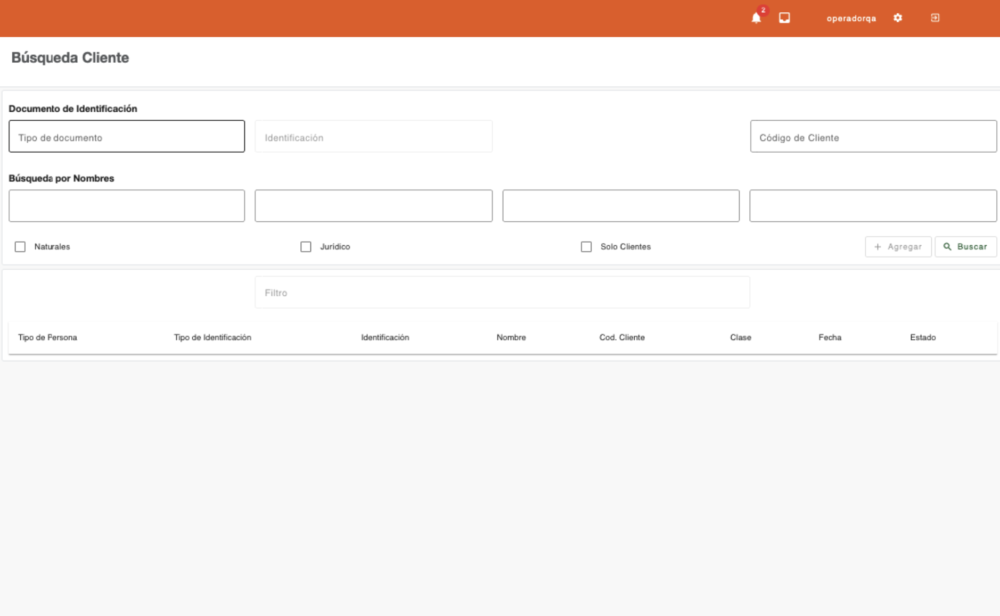

# Búsqueda de cliente

La búsqueda de clientes es el gestor en el que se centraliza la información de los clientes, facilitando la ubicación de cada persona natural o jurídica, por medio de criterios de búsqueda y filtros que permiten incluir o excluir determinado tipo de personas o clientes. 

!!! info "Consejo de uso"
    Para ejecutar la búsqueda es necesario ingresar datos en uno de los criterios de búsqueda que dispone el gestor. La búsqueda se ejecuta al utilizar el botón **Buscar** o presionar la tecla **Enter**.

## Tipos de Búsqueda Disponibles

* [Búsqueda por documento de identificación](busqueda-documento.md)
* [Búsqueda por código de cliente](busqueda-codigo.md)
* [Búsqueda por nombres](busqueda-nombres.md)
* [Búsqueda por producto](busqueda-producto.md)
* [Criterios adicionales](criterios.md)

---

## Agregar

El botón **Agregar** se habilita después de haber realizado al menos una búsqueda de personas. Este botón es utilizado para iniciar el flujo de creación de clientes para personas naturales o jurídicas.

Los pasos del flujo de creación de clientes pueden variar dependiendo del tipo de persona y los datos ingresados en cada paso.

!!! warning "Importante"
    En los flujos se permite la navegación entre los pasos por medio de los botones **Anterior** y **Siguiente**. Sin embargo, los datos principales como:
    
    * Documentos de identificación
    * Nombres y apellidos
    * Género o tipo de persona
    
    **No podrán ser modificados** una vez se haya pasado al siguiente paso.

[← Volver a Menú plataforma](../index.md)