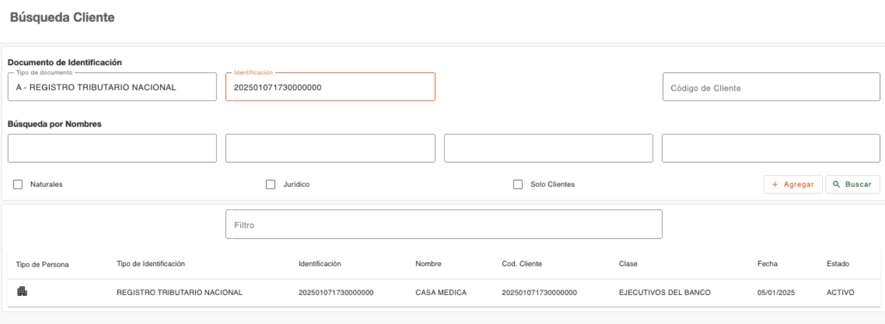

# Documento de Identificación

Permite realizar la búsqueda de una persona indicando los datos de un documento de identificación con el que esté registrado en el sistema. 

!!! abstract "Dato clave"
    Este campo es específico; no se deben indicar más datos de combinación en la búsqueda, porque solo debe existir una persona con un documento de identificación.

| Campo | Descripción | Condición |
| :--- | :--- | :--- |
| **Tipo de documento** | Lista seleccionable de tipos de documentos permitidos para realizar la búsqueda. | Opcional |
| **Identificación** | Permite indicar los datos de la identificación. En base al tipo seleccionado se recupera el formato requerido. | Requerido al seleccionar un Tipo de Documento |

---

[← Volver a Búsqueda de clientes](../busqueda-clientes/busqueda-clientes.md)

[← Volver a Menú plataforma](../index.md)