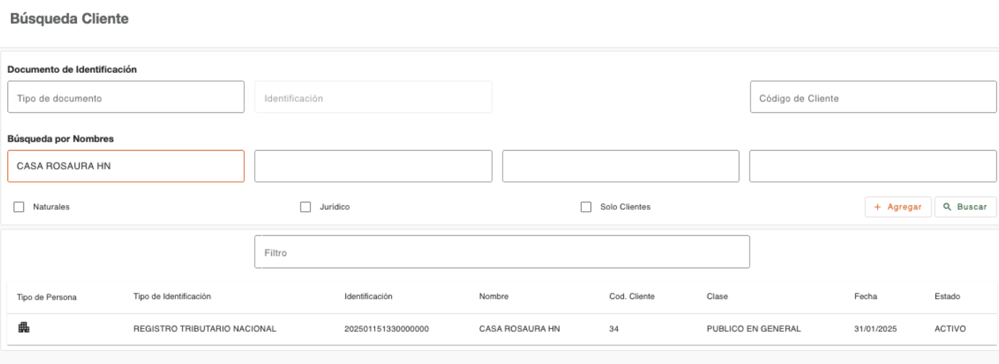
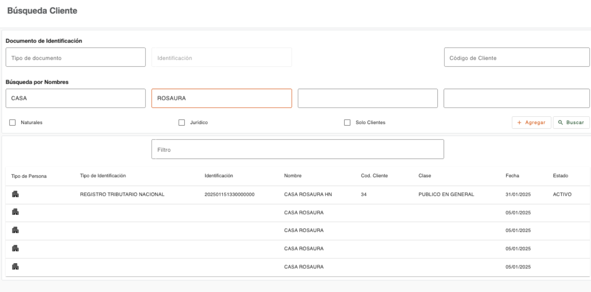

# Búsqueda por nombres

Permite realizar la búsqueda de personas por medio de los nombres exactos o palabras con las que puedan coincidir los nombres. 

Dispone de cuatro campos para realizar la búsqueda de una persona, en donde se puede indicar de forma separada cada nombre y apellido en el caso de persona natural. En el caso de persona jurídica, se puede indicar en un solo campo el nombre exacto a buscar o de forma separada, algunas de las palabras del nombre de la empresa coincidentes. 

Este criterio de búsqueda puede estar restringido de visualización en base al perfil de usuario. 

| Campo | Descripción | Condición |
| :--- | :--- | :--- |
| **Búsqueda por nombres** | Indicar el texto con el que deben coincidir los nombres de las personas a buscar. Dispone de cuatro campos en donde se pueden ingresar los textos de la búsqueda. | Opcional |

---

[← Volver a Búsqueda de clientes](../busqueda-clientes/busqueda-clientes.md)

[← Volver a Menú plataforma](../index.md)