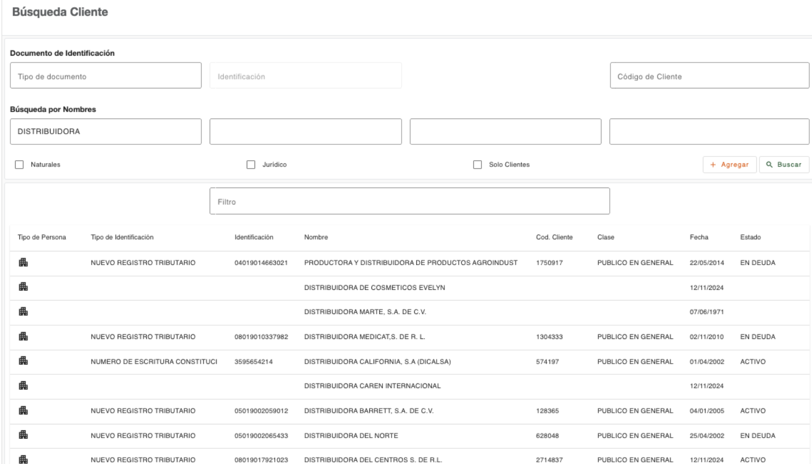

# Criterios

El gestor dispone de criterios de inclusión o exclusión de personas, estos pueden ser combinado con los criterios de búsqueda. Si no es seleccionado ninguno, se incluyen todos los registros, los criterios deben ser seleccionados antes de ejecutar la búsqueda. 

| Campo | Descripción |
| :--- | :--- |
| **Natural** | La búsqueda recupera solo las personas naturales que coincidan con los criterios de búsqueda indicados |
| **Jurídico** | La búsqueda recupera solo las personas jurídicas que coincidan con los criterios de búsqueda indicados. |
| **Jurídico** | La búsqueda recupera solo las personas que tienen un código de cliente asignado y que coincidan con los criterios de búsqueda indicados. |

Este campo permite realizar un filtro rápido de los registros mostrados en el grid por medio de la columna Nombre. Es habilitado solo cuando la búsqueda retorna registros. 

Cuando la búsqueda retorna registros, se puede seleccionar uno de los registros para consultar los datos con los que ha sido grabado el cliente o para continuar el flujo de creación de cliente, si aún no se ha completado como cliente. La información que se muestre depende del estado del flujo de creación de cliente, si está completado, muestra la pantalla de Administrar persona; si está incompleto, muestra la pantalla para completar el flujo de creación de cliente. 

---

[← Volver a Búsqueda de clientes](../busqueda-clientes/busqueda-clientes.md)

[← Volver a Menú plataforma](../index.md)

