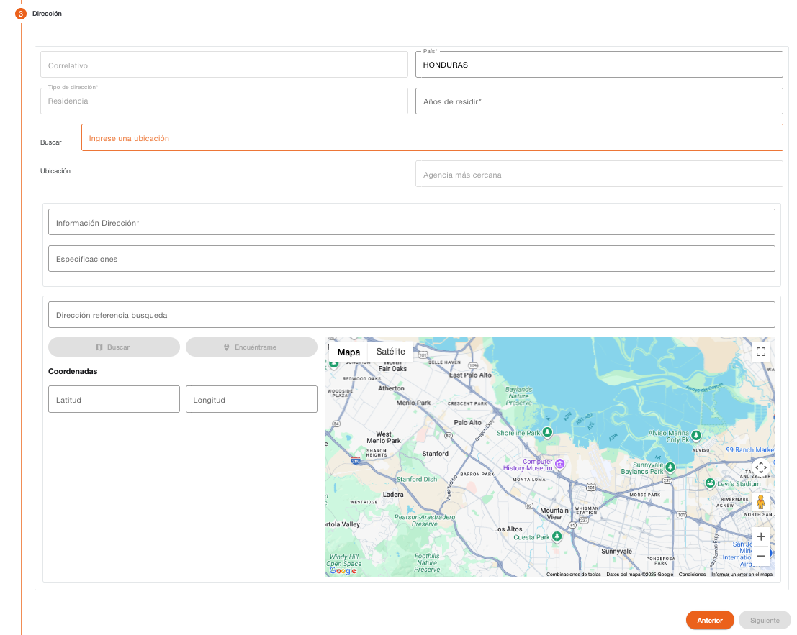

# Direccion – Persona Usuario

Permite registrar la información de la dirección en la que reside la persona. 

| Campo | Descripción | Condición |
| :--- | :--- | :--- |
| **Correlativo** | Correlativo de la dirección. | Protegido |
| **País** | País al que corresponde la dirección. | Obligatorio |
| **Tipo de Dirección** | Tipo de dirección registrada, en base a la cual se determina lo datos que se deben ingresar al registrar la dirección. | Protegido |
| **Años de Residir** | Cantidad de años de residir en esa dirección. | Obligatorio |
| **Buscar** | Buscador de distribución geográfica configurada para el país, se debe ingresar el texto a buscar, el sistema muestra una lista de registros coincidentes. Al seleccionar el registro, muestra los datos recuperados en el campo ubicación, agencia, información dirección y dirección referencia de búsqueda. | Obligatorio |
| **Ubicación** | Muestra los niveles geográficos recuperados en base al registro seleccionado en campo Buscar. | Protegido |
| **Agencia más Cercana** | Muestra la agencia más cercana recuperada en base al registro seleccionado en campo Buscar. | Protegido |
| **Información Dirección** | Información detallada de la dirección. | Obligatorio |
| **Especificaciones** | Información de referencias para ubicar la dirección. | Opcional |
| **Dirección Referencia Búsqueda** | Información detallada de la dirección que se puede utilizar para realizar la búsqueda de geoposición con el servicio de mapas utilizando el botón Buscar, para recuperar la latitud y longitud de la dirección. | Opcional |
| **Latitud** | Datos de latitud en donde se ubica la dirección. | Opcional |
| **Longitud** | Datos de longitud en donde se ubica la dirección. | Opcional |

[← Volver a página anterior](crear-usuario.md)