# Accionistas - Persona Jurídica

Registro de los accionistas que posee la persona jurídica, pueden ser personas naturales o personas jurídicas, aunque se debe considerar que el último accionista debe ser una persona natural. Esta sección es opcional, no es obligatoria la creación de accionistas.

Para agregar un accionista, primero se debe indicar el tipo de persona que será el accionista.

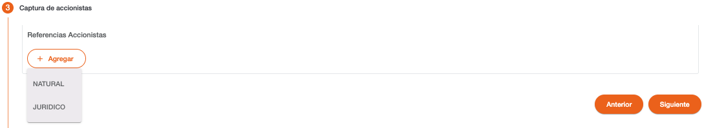

En base al documento de identificación el sistema valida si la persona ya existe en el sistema, si la persona existe, recupera los datos de la persona mostrándolos protegidos, solo los datos que no existen se muestran habilitados para completar la información requerida.

La creación de accionistas se divide en varios pasos, dependiendo del tipo de persona (Natural/Jurídica), los datos requeridos son diferentes, pero el primer paso pide los documentos de identificación. 

Del listado de tipos de documentos mostrado, hay algunos que son requeridos y otros son opcionales, esto depende de cómo están definidos los parámetros de tipos de documentos por rol de persona “CLIENTE”.  

Persona Natural 

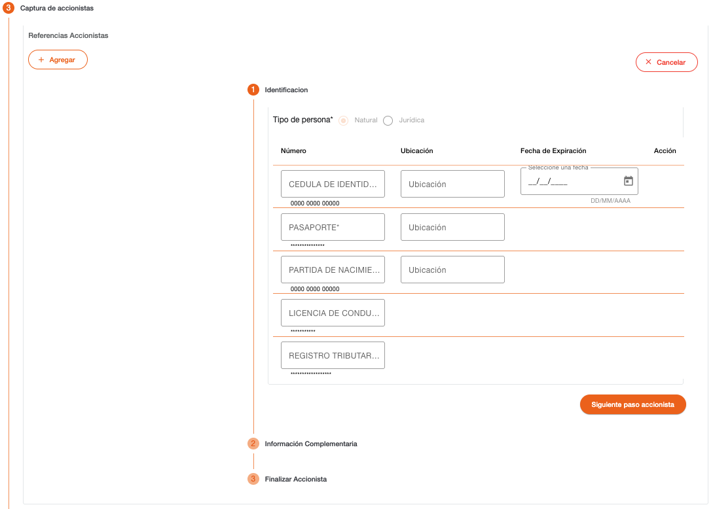

Persona Jurídica

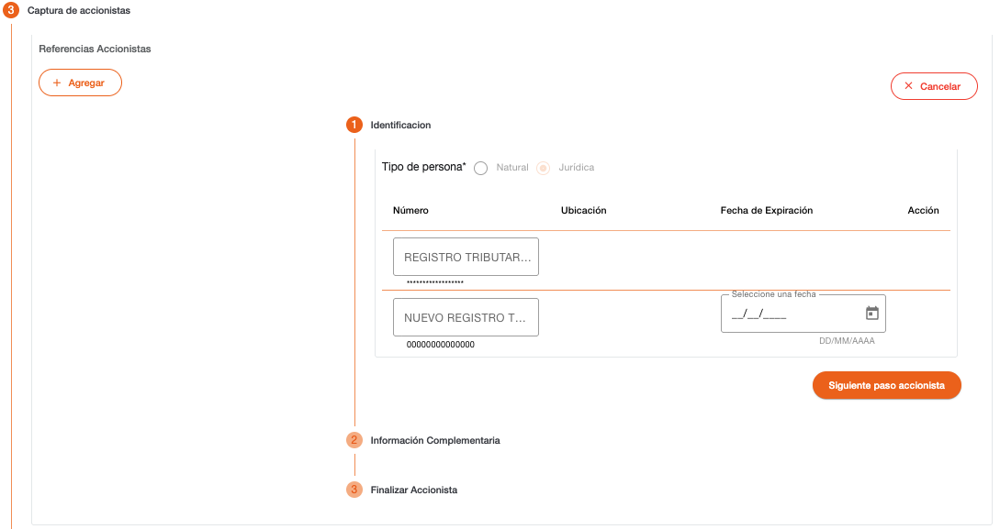

Es necesario el ingreso de por lo menos un documento de identificación, si no se ingresan los datos de documentos de identificación requeridos, el sistema muestra un dialogo de solicitud de credenciales, para autorizar la continuidad del flujo, sin haber ingresado el tipo de documento requerido.  

Los datos requeridos por tipo de documento de identificación pueden ser número de identificación, ubicación y fecha de expiración. 

| Campo | Descripción | Condición |
| :--- | :--- | :--- |
| **Número** | Número de identificación de la persona. El campo valida que sea ingresado en el formato configurado para el tipo de documento. En base a este número, el sistema puede recuperar datos que son validados en los parámetros de ubicaciones geográficas o validar el año de nacimiento. | Es necesario ingresar al menos un documento de identificación. |
| **Ubicación** | No todos los documentos pueden requerir este dato. Solo si el tipo de documento tiene configurado que requiere ubicación, se mostrará este campo. Permite indicar el lugar donde fue emitido el documento. Dependiendo de la configuración, puede llenarse automáticamente y quedar protegido. | Obligatorio si es ingresado el número de identificación. |
| **Fecha de Expiración** | Solo si el tipo de documento requiere fecha de expiración, este campo será mostrado. Permite indicar la fecha en la que expira el documento; la fecha no puede ser menor a la actual. | Obligatorio si es ingresado el número de identificación. |

El sistema realiza validaciones de lista de cautela por documento de identificación y muestra los mensajes correspondientes si encuentra la identificación en alguna lista de cautela (Notificación, Solicitar Autorización, Detener). 

Es necesario ingresar por lo menos los datos de un tipo de documento para habilitar el botón Siguiente Paso Accionista. 

Mensajes de Error 

| Mensaje | Descripción |
| :--- | :--- |
| **La entrada está incompleta** | No ha sido ingresada la información completamente conforme al formato esperado de la identificación. |
| **Ubicación requerida** | Debe seleccionar de la lista seleccionable, el lugar de emisión del documento de identificación. |
| **Persona existente** | Indica que la persona fue encontrada en base al número de documento de identificación. |

Al indicar los datos de un documento de identificación de una persona que ya existe en el sistema, serán recuperados los datos que tiene registrados los cuales se mostrarán protegidos en los siguientes pasos, solo se muestran habilitados los campos de información que no tiene grabada la persona. 

## Accionista- Natural

Pasos para crear un accionista con una persona jurídica. 

| Campo | Descripción | Condición |
| :--- | :--- | :--- |
| **País de Origen** | País de origen de la persona natural. Si es una persona existente que ya tiene este dato, el campo se muestra protegido. | Obligatorio |
| **Tipo** | Tipo de accionista. | Obligatorio |
| **% de Participación** | Porcentaje de participación del accionista. Cuando el porcentaje es mayor o igual al 10% y el País de Origen es Estados Unidos habilita campos para ingresar documentos FATCA. | Obligatorio |

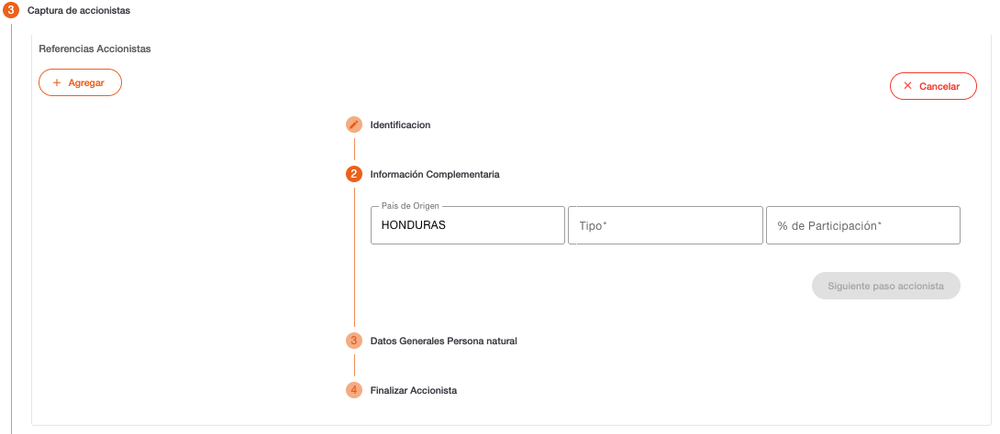

| Campo | Descripción | Condición |
| :--- | :--- | :--- |
| **Primer Apellido** | Primer apellido de la persona. | Obligatorio |
| **Segundo Apellido** | Segundo apellido de la persona. | Opcional |
| **Primer Nombre** | Primer nombre de la persona. | Obligatorio |
| **Segundo Nombre** | Segundo nombre de la persona. | Opcional |
| **Otros Nombres** | Otros nombres de la persona. | Opcional |
| **País de Origen** | País de origen de la persona, el mismo que el país de nacimiento. | Obligatorio |
| **Género** | Indica si la persona es de género masculino o femenino. | Obligatorio |
| **País de Nacimiento** | País en el que nació la persona, es el mismo que país de origen. | Protegido |
| **País de Residencia** | País en el que reside actualmente la persona. | Obligatorio |
| **Nacionalidad** | Nacionalidad que indica el documento de identificación. | Obligatorio |
| **Región** | Región en donde nació la persona, este campo se habilita solo si el país de nacimiento tiene regiones configuradas. | Obligatorio |
| **Departamento** | Departamento en donde nació la persona, este campo se habilita solo si el país de nacimiento tiene departamentos configurados. | Obligatorio |
| **Municipio** | Municipio en donde nació la persona, este campo se habilita solo si el país de nacimiento tiene municipios configurados. | Obligatorio |
| **2da. Nacionalidad** | Segunda nacionalidad que indica el documento de identificación. | Opcional |

Cuando la persona reside en el extranjero o tiene una nacionalidad extranjera, será requerido indicar los documentos de identificación correspondientes, estos pueden variar dependiendo si es de Estados Unidos o de algún otro país. Si en los pasos anteriores fueron indicados los datos de estos documentos de identificación, serán recuperados y mostrados con los campos protegidos. Los campos son los mismos descritos en el primer paso para capturar los documentos de identificación. 

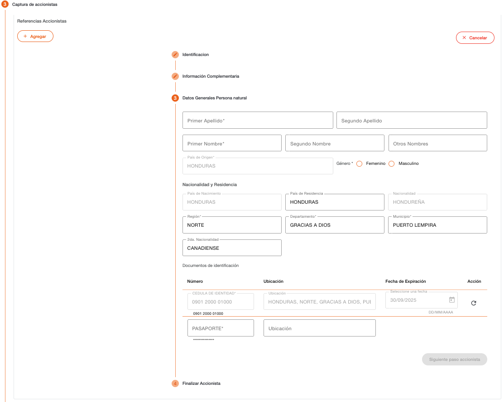

En el último que corresponde a finalizar, al utilizar el botón Agregar el sistema realiza validaciones de lista de cautela y muestra los mensajes correspondientes si lo encuentra (Notificación, Solicitar Autorización, Detener), de lo contrario es creada la relación entre el accionista y el cliente principal.  

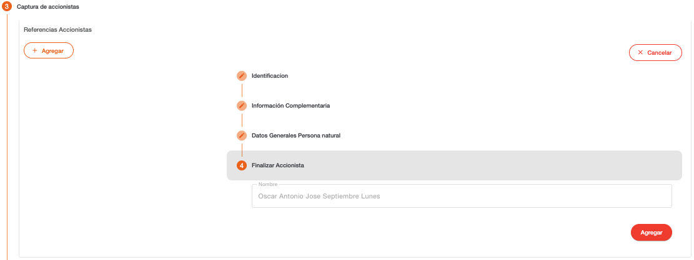

### Accionista - Juridico

Pasos para crear un accionista con una persona jurídica. 

| Campo | Descripción | Condición |
| :--- | :--- | :--- |
| **Tipo** | Tipo de accionista. | Obligatorio |
| **% de Participación** | Porcentaje de participación del accionista. | Obligatorio |

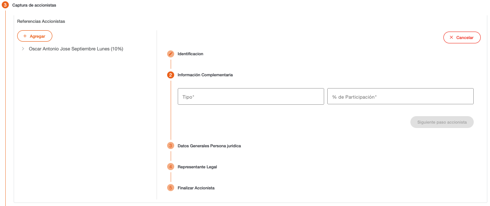

| Campo | Descripción | Condición |
| :--- | :--- | :--- |
| **Nombre** | Nombre de la persona jurídica. | Obligatorio |
| **País de Origen** | País de origen de la persona jurídica. Cuando el porcentaje es mayor o igual al 10% y el País de Origen es Estados Unidos habilita campos para ingresar documentos FATCA. | Obligatorio |

Cuando la persona reside en el extranjero o tiene una nacionalidad extranjera, será requerido indicar los documentos de identificación correspondientes, estos pueden variar dependiendo si es de Estados Unidos o de algún otro país. Si en los pasos anteriores fueron indicados los datos de estos documentos de identificación, serán recuperados y mostrados con los campos protegidos. Los campos son los mismos descritos en el primer paso para capturar los documentos de identificación. 

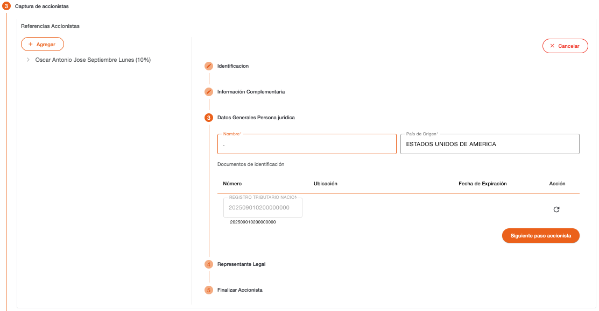

Cuando el accionista es persona jurídica se capturan los datos de representante legal, en donde primero se deben indicar los documentos de identificación. Los campos son los mismos descritos en el primer paso para capturar los documentos de identificación. 

| Campo | Descripción | Condición |
| :--- | :--- | :--- |
| **Primer Apellido** | Primer apellido de la persona. | Obligatorio |
| **Segundo Apellido** | Segundo apellido de la persona. | Opcional |
| **Primer Nombre** | Primer nombre de la persona. | Obligatorio |
| **Segundo Nombre** | Segundo nombre de la persona. | Opcional |
| **Otros Nombres** | Otros nombres de la persona. | Opcional |
| **País de Origen** | País de origen de la persona, el mismo que el país de nacimiento. | Obligatorio |
| **Género** | Indica si la persona es de género masculino o femenino. | Obligatorio |

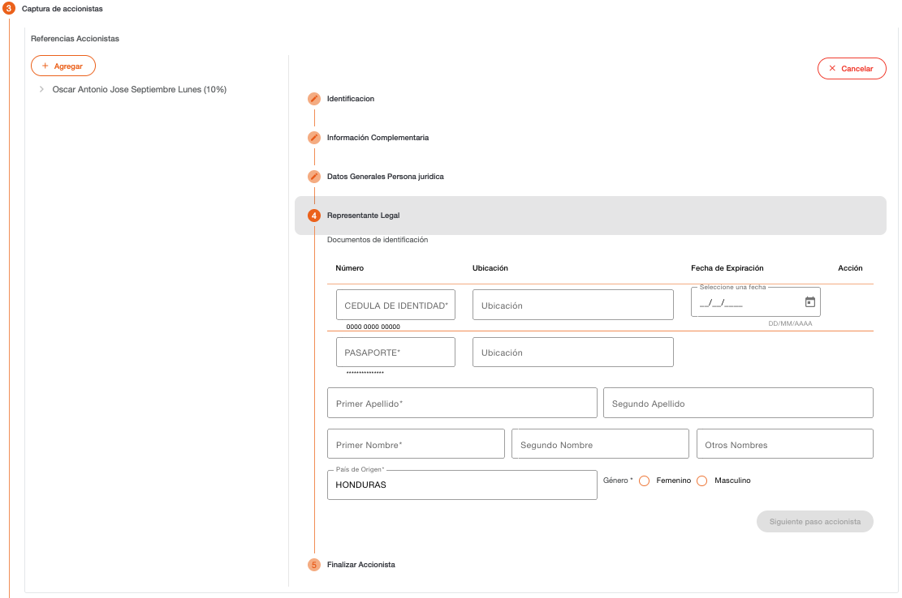

En el último paso que corresponde a finalizar, al utilizar el botón Agregar el sistema realiza validaciones de lista de cautela y muestra los mensajes correspondientes si lo encuentra (Notificación, Solicitar Autorización, Detener), de lo contrario es creada la relación entre el accionista y el cliente principal.  

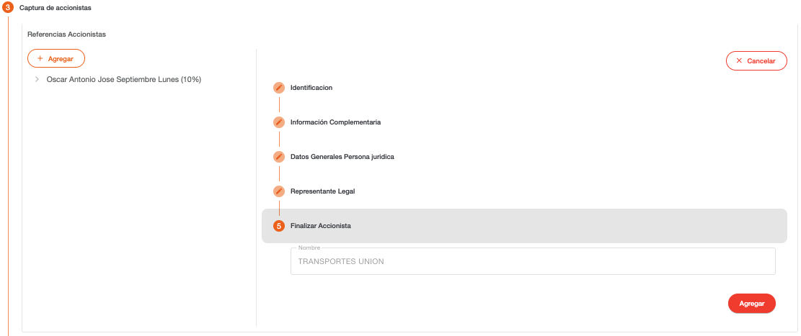

Cuando es un accionista jurídico, considerar que el último elemento debe ser un accionista natural, el cual debe ser agregado para poder continuar con los pasos.

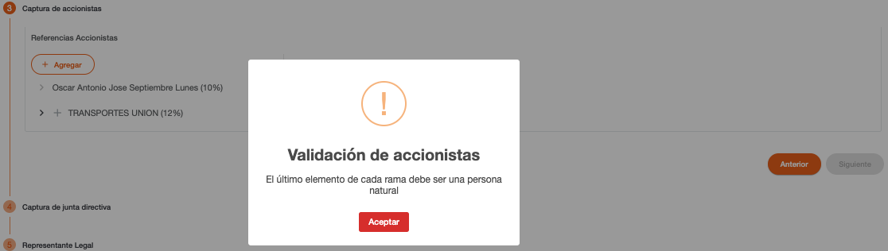

[← Volver a página anterior](crear-cliente-juridica.md)
