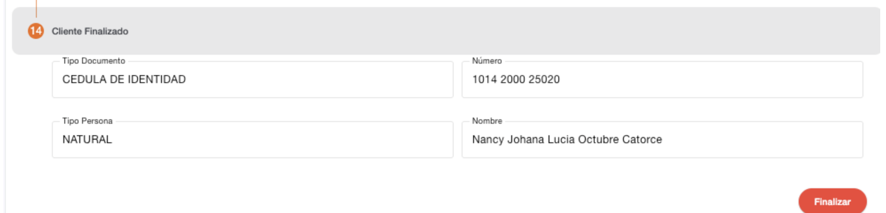
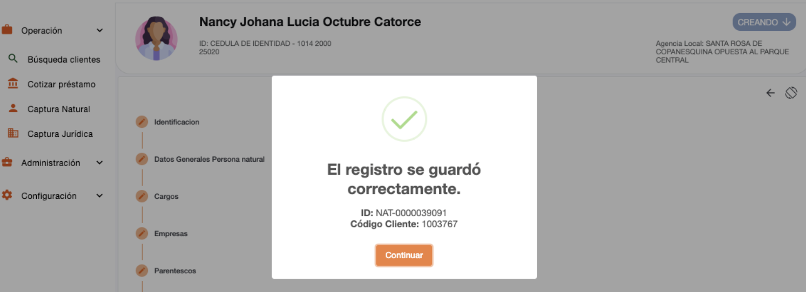

# Cliente Finalizado – Persona Natural

Este es el último paso en la creación de la persona, se finaliza la captura de datos y se muestran los datos con los que fue creado el cliente. El sistema se redirecciona a la administración de persona en donde se puede consultar la información con la que fue creada la persona o gestionar operaciones con el cliente.

En este paso el sistema cambia el estado del cliente, para que se muestre como activo. Solo en el caso de ser PEP, no es realizado el cambio de estado si esta pendiente de aprobación PEP.

[← Volver a página anterior](crear-cliente-natural.md)