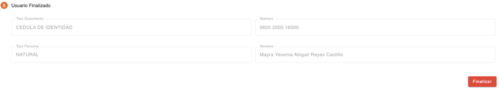
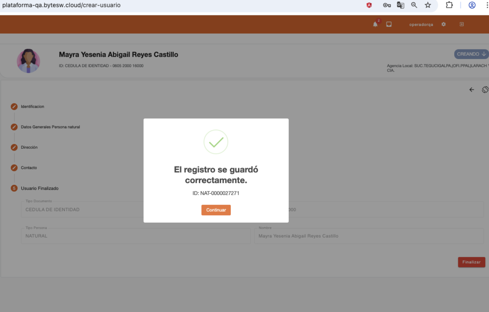

# Cliente finalizado - Persona Natural

Este es el último paso en la creación de la persona tipo “Usuario”, se finaliza la captura de datos y se muestran los datos con los que fue creada la persona. 

[← Volver a página anterior](crear-usuario.md)