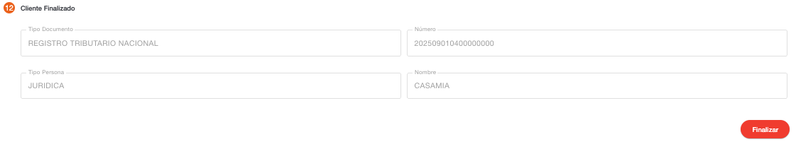
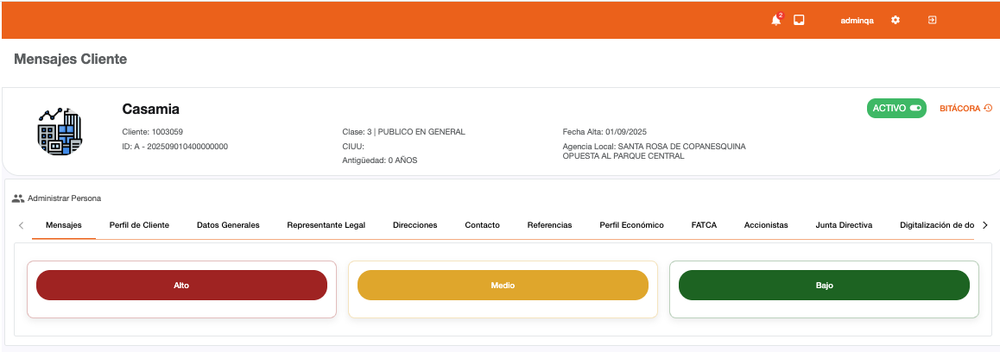

# Cliente Finalizado - Persona Jurídica

Este es el último paso en la creación de la persona jurídica, se finaliza la captura de datos y se muestran los datos con los que fue creado el cliente. El sistema se redirecciona a la administración de persona en donde se puede consultar la información con la que fue creada la persona o gestionar operaciones con el cliente.

En este paso el sistema realiza el cambio de estado al cliente para establecerlo como activo.

[← Volver a página anterior](crear-cliente-juridica.md)