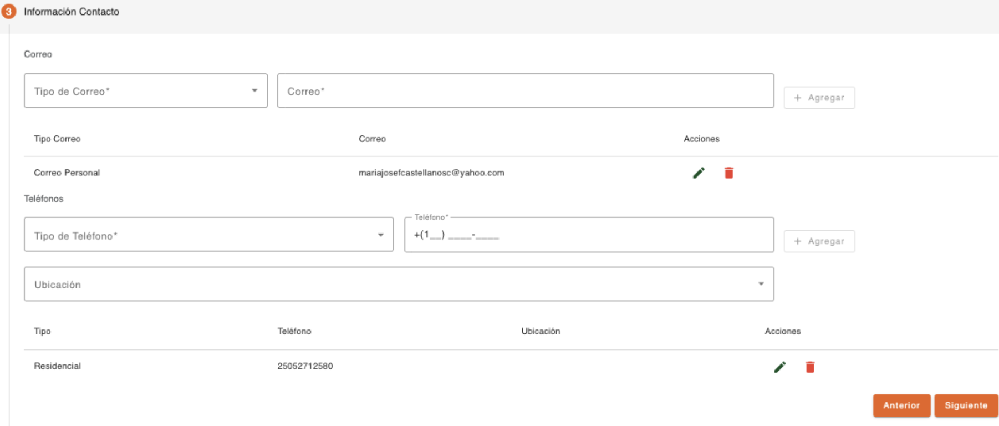

# Contacto – PEP Cónyuge

Registro de datos de contacto del cónyuge de la persona PEP. Es obligatorio registrar como mínimo un correo y un teléfono. 

Es importante considerar que los datos de contacto tanto correos electrónicos como teléfonos, no deben existir registrados con otra persona. 

| Campo | Descripción | Condición |
| :--- | :--- | :--- |
| **Tipo de Correo** | Tipo de correo para contactar a la persona. | Obligatorio |
| **Correo** | Dirección de correo electrónico de la persona. El correo no debe existir registrado con otra persona. | Obligatorio |

| Campo | Descripción | Condición |
| :--- | :--- | :--- |
| **Tipo de Teléfono** | Tipo de teléfono para contactar a la persona. | Obligatorio |
| **Teléfono** | Teléfono de la persona. El sistema sugiere el área de marcación correspondiente al país local, el cual se puede modificar. El teléfono no debe existir registrado con otra persona. | Obligatorio |
| **Ubicación** | Dirección relacionada al teléfono de la persona. Muestra un listado de direcciones registradas a la persona. | Opcional |

[Volver a página anterior](pep-conyuge.md)
