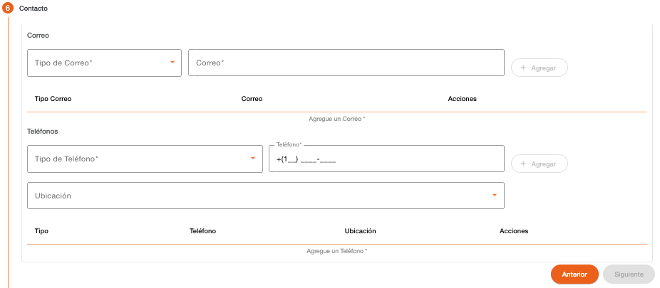

# Contacto – Persona Natural

Registro de datos de contacto de la persona. Es obligatorio registrar como mínimo un correo y un teléfono. 

Es importante considerar que los datos de contacto, tanto correos electrónicos como teléfonos, no deben existir registrados con otra persona. 

| Campo | Descripción | Condición |
| :--- | :--- | :--- |
| **Tipo de Correo** | Tipo de correo para contactar a la persona. | Obligatorio |
| **Correo** | Dirección de correo electrónico de la persona. El correo no debe existir registrado con otra persona. | Obligatorio |
| **Tipo de Teléfono** | Tipo de teléfono para contactar a la persona. | Obligatorio |
| **Teléfono** | Teléfono de la persona. El sistema sugiere el área de marcación correspondiente al país local, el cual se puede modificar. El teléfono no debe existir registrado con otra persona. | Obligatorio |
| **Ubicación** | Dirección relacionada al teléfono de la persona. Muestra un listado de direcciones registradas a la persona. | Opcional |

[←Volver a página anterior](crear-cliente-natural.md)