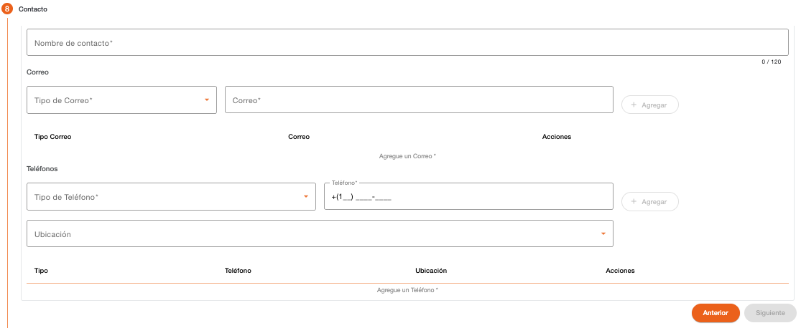

# Contacto

Registro de datos de contacto de la persona jurídica. Es obligatorio registrar como mínimo un correo y un teléfono para continuar con el flujo de la creación de cliente. (Siguiente)

Es importante considerar que los datos de contacto, tanto correos electrónicos como teléfonos, no deben existir registrados con otra persona.

| Campo | Descripción | Condición |
| :--- | :--- | :--- |
| **Nombre de Contacto** | Nombre de la persona establecida como contacto en la institución. | Obligatorio |
| **Tipo de Correo** | Tipo de correo para contacto. | Obligatorio |
| **Correo** | Dirección de correo electrónico del contacto. El correo no debe existir registrado con otra persona. | Obligatorio |

| Campo | Descripción | Condición |
| :--- | :--- | :--- |
| **Tipo de Teléfono** | Tipo de teléfono de contacto. | Obligatorio |
| **Teléfono** | Teléfono de la persona para contacto. El sistema sugiere el área de marcación correspondiente al país local, el cual se puede modificar. El teléfono no debe existir registrado con otra persona. | Obligatorio |
| **Ubicación** | Dirección relacionada al teléfono de contacto. Muestra un listado de direcciones registradas a la persona. | Opcional |

[← Volver a página anterior](crear-cliente-juridica.md)