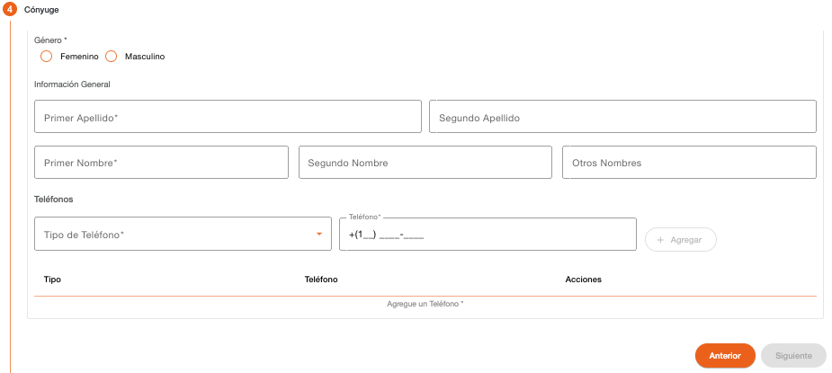

# Cónyuge - Persona Natural

Permite registrar la información del cónyuge de la persona, esta sección se muestra solo cuando la persona no es PEP y tiene un estado civil que requiera datos de cónyuge, cuando es PEP los datos de cónyuge serán requeridos en el flujo de personas PEP

| Campo | Descripción | Condición |
| :--- | :--- | :--- |
| **Género** | Indica si la persona es de género masculino o femenino. | Obligatorio |
| **Primer Apellido** | Primer apellido de la persona. | Obligatorio |
| **Segundo Apellido** | Segundo apellido de la persona. | Opcional |
| **Primer Nombre** | Primer nombre de la persona. | Obligatorio |
| **Segundo Nombre** | Segundo nombre de la persona. | Opcional |
| **Otros Nombres** | Otros nombres de la persona. | Opcional |

Registro de datos de contacto del cónyuge de la persona. Es obligatorio registrar como mínimo un teléfono. 

Es importante considerar que los datos de contacto no deben existir registrados con otra persona. 

| Campo | Descripción | Condición |
| :--- | :--- | :--- |
| **Tipo de Teléfono** | Tipo de teléfono para contactar a la persona. | Obligatorio |
| **Teléfono** | Teléfono de la persona. El sistema sugiere el área de marcación correspondiente al país local, el cual se puede modificar. El teléfono no debe existir registrado con otra persona. | Obligatorio |
| **Ubicación** | Dirección relacionada al teléfono de la persona. Muestra un listado de direcciones registradas a la persona. | Opcional |

---

[← Volver a página anterior](crear-cliente-natural.md)