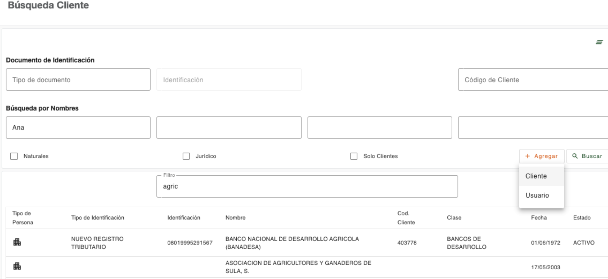

# Crear clientes

El botón Agregar de la Búsqueda de Clientes dispone de dos opciones para agregar registros (Cliente/Usuario), ya sea para creación de clientes completos o solo usuarios (personas) que frecuentan la institución a realizar determinadas transacciones, que por políticas requieren la captura de sus datos generales, los cuales quedan creados solo como personas y no como clientes, motivo por el cual la cantidad de pasos para crear un usuario es menor que para crear un cliente. 

* [Crear cliente - Persona Natural](crear-cliente-natural.md)
* [Crear cliente - Persona Jurídica](crear-cliente-juridica.md)
* [Crear Usuario](crear-usuario.md)

---

[← Volver a Menú plataforma](../index.md)