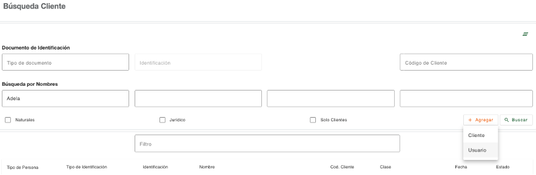

# Crear Usuario

Los tipos de persona “Usuario” son las que frecuentan la institución a realizar determinadas transacciones, que por políticas requieren la captura de sus datos generales, los cuales quedan creados solo como personas y no como clientes, motivo por el cual la cantidad de pasos para crear un usuario es menor que para crear un cliente.

* [Identificación - Persona Usuario](Identificación_Persona_Usuario.md)
* [Datos Generales - Persona Usuario](Datos Generales_Persona_Usuario.md)
* [Dirección - Persona Usuario](Dirección_Persona_Usuario.md)
* [Contacto - Persona Usuario](contacto_persona_Usuario.md)
* [Cliente Finalizado - Persona Usuario](cliente_finalizado_persona_Usuario.md)

[← Volver a página anterior](crear-cliente.md)