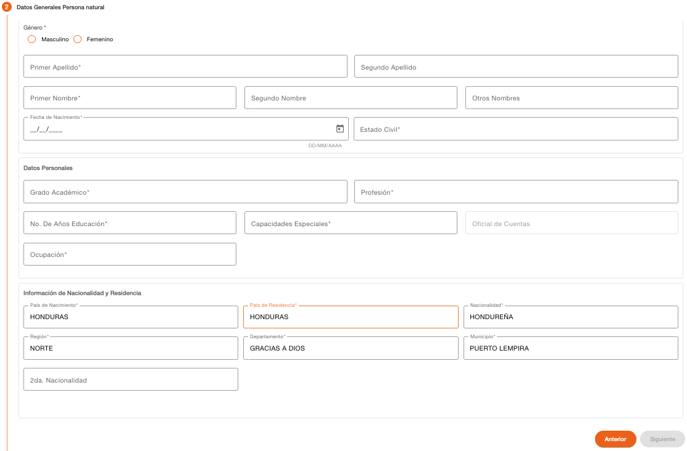

# Datos generales - Persona Natural

Este paso permite capturar los datos generales con los que puede ser creada una persona natural. Algunos campos adicionales son habilitados dependiendo de los datos que son indicados al crear la persona. 

| Campo | Descripción | Condición |
| :--- | :--- | :--- |
| **Genero** | Indica si la persona es de género masculino o femenino. | Obligatorio |
| **Primer apellido** | Primer apellido de la persona | Obligatorio |
| **Segundo apellido** | Segundo apellido de la persona | Opcional |
| **Primer nombre** | Primer nombre de la persona | Obligatorio |
| **Segundo nombre** | Segundo nombre de la persona | Opcional |
| **Otros nombres** | Otros nombres de la persona | Opcional |
| **fecha de nacimiento** | Fecha de nacimiento que indica el documento de identificación. El sistema valida que esta fecha coincida con el formato del número de identificación. En base a esta fecha se determinar si la persona es menor de edad y evaluar si es necesario autorizar la creación de la persona. | Obligatorio |
| **Estado civil** | Estado civil indicado en el documento de identificación. Si la persona es casada o tiene un estado similar, en los siguientes pasos será requerido indicar datos del cónyuge. | Obligatorio |
| **Grado academico** | Grado academico de la persona | Obligatorio |
| **Profesión** | Grado academico de la persona | Obligatorio |
| **Fecha de Profesión** | Fecha de inicio de profesión. Este campo es mostrado solo si la profesión tiene configurado que requiere fecha. | Obligatorio |
| **No. años educación** | Número de años de formación educativa que ha tenido la persona. | Obligatorio |
| **Capacidades especiales** | Permite indicar si la persona tiene alguna capacidad especial. | Obligatorio |
| **Oficial de Cuentas** | Oficial de cuentas al que esta asignado el cliente. Campo protegido en el flujo de crear cliente. | Opcional |
| **Ocupación** | Ocupación actual de la persona. | Obligatorio |
| **País de Nacimiento** | País en el que nació la persona de acuerdo con la identificación. | Obligatorio |
| **País de Residencia** | País en el que reside actualmente la persona. | Obligatorio |
| **Nacionalidad** | Nacionalidad que indica el documento de identificación. | Obligatorio |
| **Región** | Región en donde nació la persona, este campo se habilita solo si el país de nacimiento tiene regiones configuradas. | Obligatorio |
| **Departamento** | Departamento en donde nació la persona, este campo se habilita solo si el país de nacimiento tiene departamentos configurados. | Obligatorio |
| **Municipio** | Municipio en donde nació la persona, este campo se habilita solo si el país de nacimiento tiene municipios configurados. | Obligatorio |
| **2da. Nacionalidad** | Segunda nacionalidad que indica el documento de identificación. | Obligatorio |

Cuando la persona reside en el extranjero o tiene una nacionalidad extranjera, será requerido indicar los documentos de identificación correspondientes, estos pueden variar dependiendo si es de Estados Unidos o de algún otro país. Si en los pasos anteriores fueron indicados los datos de estos documentos de identificación, serán recuperados y mostrados con los campos protegidos. 

Los datos requeridos por tipo de documento de identificación pueden ser número de identificación, ubicación y fecha de expiración. 

| Campo | Descripción | Condición |
| :--- | :--- | :--- |
| **Número** | Número de identificación de la persona, el campo valida que sea ingresado en el formato configurado para el tipo de documento. | Es necesario ingresar al menos un documento de identificación. |
| **Ubicación** | No todos los documentos pueden requerir este dato, solo si el tipo de documento de identificación tiene configurado que requiere ubicación, será mostrado este campo. Permite indicar el lugar en donde fue emitido el documento de identificación, dependiendo de la configuración del tipo de documento, puede recuperar estos datos de forma automática del número de identificación y proteger los datos de este campo para que no sean modificados. | Obligatorio si es ingresado el número de identificación. |
| **Fecha de Expiración** | No todos los documentos pueden requerir este dato, es mostrado solo si el tipo de documento de identificación tiene configurado que requiere fecha de expiración. Permite indicar la fecha en la que expira el documento de identificación; la fecha no puede ser menor a la fecha actual. | Obligatorio si es ingresado el número de identificación. |

El sistema realiza validaciones de lista de cautela por documento de identificación y muestra los mensajes correspondientes si encuentra la identificación en alguna lista de cautela (Notificación, Solicitar Autorización, Detener).

Del listado de tipos de documentos mostrado, hay algunos que son requeridos y otros son opcionales, esto depende como están definidos los parámetros de tipos de documentos por rol de persona, en este caso los roles “CLIENTE\_ FATCA” para Estados Unidos o “CLIENTE\_INTER” para cualquier otro país. Si falta un tipo de documento de identificación que es requerido en esta sección, muestra un dialogo de solicitud de credenciales, para autorizar la continuidad del flujo, sin haber ingresado el tipo de documento requerido. 

Es necesario indicar todos los datos obligatorios para habilitar el botón Siguiente. 

## Mensajes de Error

| Campo | Descripción |
| :--- | :--- |
| **Año de fecha de Nacimiento no coincide con el Documento** | La fecha de nacimiento seleccionada no coincide con la fecha que el sistema recupera en base al documento de identificación. |
| **La persona es menor de edad** | En base a la fecha de nacimiento el sistema identifica que la persona es menor de edad y muestra este menaje para notificar que va a ser requerida una autorización para continuar con el flujo. |

### Autorización Menor de Edad

Cuando la persona a crear es menor de edad, el sistema muestra un dialogo de solicitud de credenciales, para autorizar la continuidad del flujo. La solicitud puede ser autorizada de forma local o remota, dependiendo del nivel de permisos que tenga asignados el usuario y el que requiere la autorización.  

{ .img-center }

#### Validación Listas de Cautela

El sistema valida si el documento de identificación o el nombre de la persona se encuentran registrados en alguna lista de cautela, dependiendo del tipo de lista puede ser solo un mensaje informativo o puede requerir credenciales para autorizar la continuidad del flujo o detener la operación y no permitir continuar con el flujo. 

{ .img-center }

---

[← Volver a página anterior](crear-cliente-natural.md)

