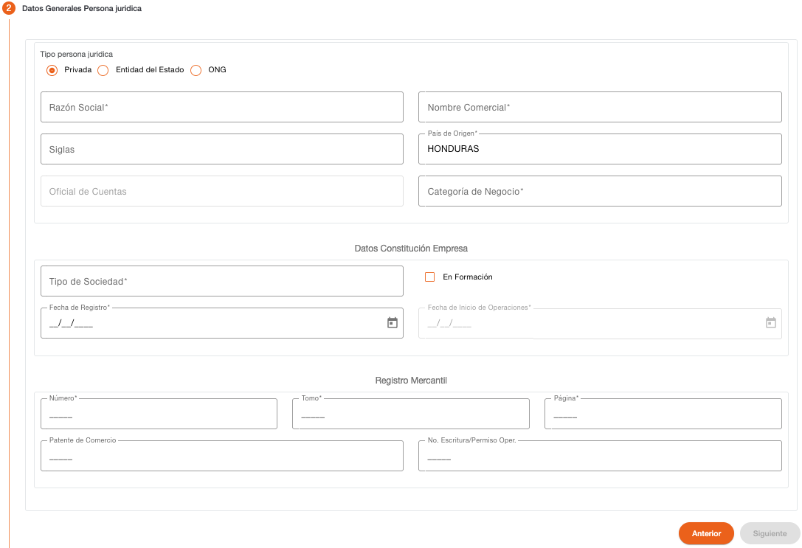

# Datos Generales - Persona Jurídica

Este paso permite capturar los datos generales para crear una persona jurídica.

| Campo | Descripción | Condición |
| :--- | :--- | :--- |
| **Tipo Persona Jurídica** | Indica el tipo de persona jurídica. | Obligatorio |
| **Razón Social** | Texto del nombre de la razón social. | Obligatorio |
| **Nombre Comercial** | Texto del nombre comercial. | Obligatorio |
| **Siglas** | Siglas del nombre de la persona jurídica. | Opcional |
| **País de Origen** | País de origen de la persona jurídica. | Obligatorio |
| **Oficial de Cuentas** | Oficial de cuentas asignado. No es habilitado en este paso. | Protegido |
| **Categoría de Negocio** | Categoría con la que es clasificado el negocio. | Obligatorio |
| **Tipo de Sociedad** | Tipo de sociedad de la persona jurídica. | Obligatorio |
| **En Formación** | Indica si la persona jurídica está en proceso de formación, por defecto es “No”. | Opcional |
| **Fecha de Registro** | Fecha en la que fue registrada la persona jurídica en base a la documentación presentada. Es opcional si está “En Formación”. | Obligatorio |
| **Fecha de Inicio de Operaciones** | Fecha en la que legalmente inicia operaciones la persona jurídica. | Obligatorio |
| **Número** | Número de registro mercantil. | Obligatorio |
| **Tomo** | Número de tomo. | Opcional |
| **Página** | Número de página. | Obligatorio |
| **Patente de Comercio** | Número de patente de comercio. | Obligatorio |
| **No. Escritura / Permiso Operación** | Número de escritura o permiso de operación. | Obligatorio |

Es necesario indicar todos los datos obligatorios para habilitar el botón Siguiente.

### Validación Listas de Cautela

El sistema valida si el documento de identificación o el nombre de la persona se encuentran registrados en alguna lista de cautela, dependiendo del tipo de lista puede ser solo un mensaje informativo o puede requerir credenciales para autorizar la continuidad del flujo o detener la operación y no permitir continuar con el flujo.

[← Volver a página anterior](crear-cliente-juridica.md)

