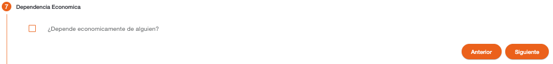
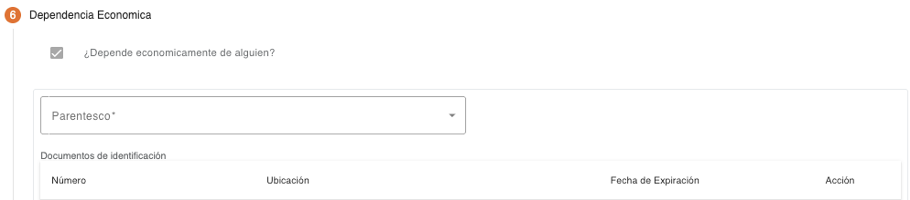

# Dependencia Económica – Persona Natural

Registro de las personas de las cuales depende económicamente la persona. Cuando la persona es mayor de edad, el registro de los datos es opcional, los demás campos son habilitados al seleccionar la pregunta “¿Depende económicamente de alguien?”.

Cuando la persona es menor de edad, el registro de los datos es obligatorio, la pregunta “¿Depende económicamente de alguien?” se muestra seleccionada y protegida.

Primero se debe indicar el parentesco que tiene con la persona que depende económicamente, después se deben indicar los documentos de identificación y los nombres de la persona. 

Los datos requeridos por tipo de documento de identificación pueden ser número de identificación, ubicación y fecha de expiración. 

| Campo | Descripción | Condición |
| :--- | :--- | :--- |
| **Número** | Número de identificación del documento de la persona, el campo valida que sea ingresado en el formato configurado para el tipo de documento. | Requerido al seleccionar el campo “Conoce el número de identificación.” |
| **Ubicación** | No todos los documentos pueden requerir este dato, solo si el tipo de documento de identificación tiene configurado que requiere ubicación, será mostrado este campo. Permite indicar el lugar en donde fue emitido el documento. | Obligatorio al ingresar el número de identificación. |
| **Fecha de Expiración** | No todos los documentos pueden requerir este dato, es mostrado solo si el tipo de documento de identificación tiene configurado que requiere fecha de expiración. | Obligatorio al ingresar el número de identificación. |

El sistema realiza validaciones de lista de cautela por documento de identificación y muestra los mensajes correspondientes si encuentra la identificación en alguna lista de cautela (Notificación, Solicitar Autorización, Detener). 

Si el número de documento de identificación ingresado existe registrado en el sistema, serán recuperados los datos de la persona con campos protegidos.

Del listado de tipos de documentos mostrado, hay algunos que son requeridos y otros son opcionales, esto depende del rol “DEPENDE_DE”. Si falta un documento requerido, el sistema solicitará credenciales para autorizar la continuidad del flujo.

| Campo | Descripción | Condición |
| :--- | :--- | :--- |
| **Parentesco** | Parentesco de la persona de la cual depende económicamente. | Obligatorio |
| **Primer Apellido** | Primer apellido de la persona. | Obligatorio |
| **Segundo Apellido** | Segundo apellido de la persona. | Opcional |
| **Primer Nombre** | Primer nombre de la persona. | Obligatorio |
| **Segundo Nombre** | Segundo nombre de la persona. | Opcional |
| **Otros Nombres** | Otros nombres de la persona. | Opcional |

[← Volver a página anterior](crear-cliente-natural.md)