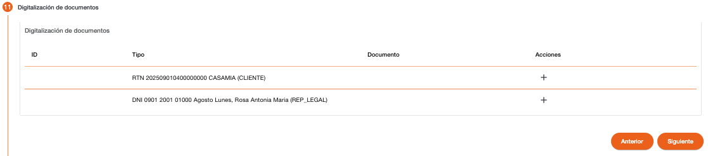
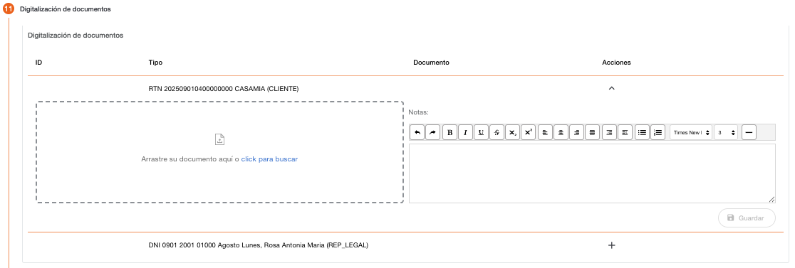
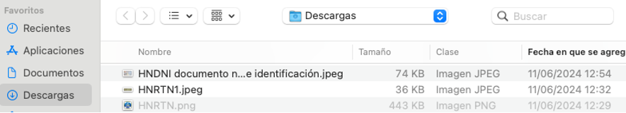
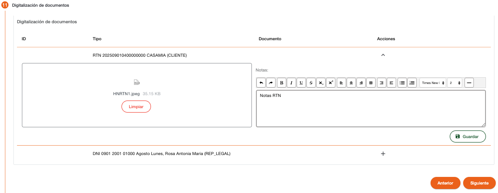
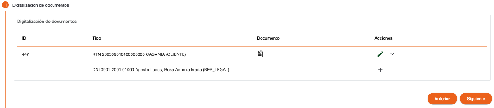
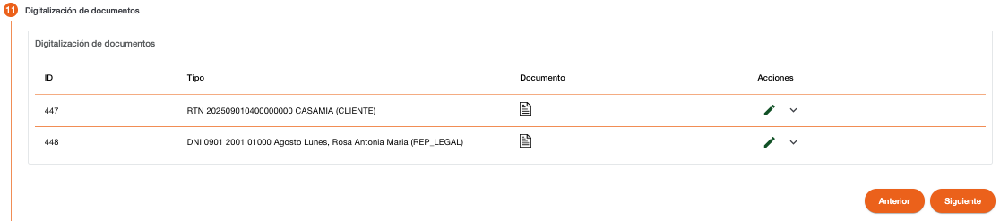

# Digitalización de Documentos - Persona Jurídica

Registro digitalizado de los documentos de identificación presentados por la persona. En el caso de persona natural solo requiere los documentos de identificación, pero en el caso de persona jurídica, dependiendo de la categoría de negocio registrada, pueden ser requerido algunos otros documentos específicos, dependiendo de la configuración de digitalización de documentos en el sistema. 

El registro de las imágenes es obligatorio, el sistema valida que hayan sido agregadas las imágenes de cada documento de identificación, si falta algún documento de identificación, el sistema muestra un dialogo de solicitud de credenciales, para autorizar la continuidad del flujo.

Para adjuntar las imágenes de los documentos de identificación, se debe seleccionar el documento en la acción (+), se muestran el campo donde se puede hacer clic para buscar la imagen o arrastrar la imagen al área delimitada por una línea punteada. 

Al seleccionar el directorio en donde están ubicadas las imágenes, se muestran habilitados los tipos de archivos que el sistema permite adjuntar, los demás archivos se muestran deshabilitados para selección.

Una vez seleccionado el archivo, se muestra el nombre del archivo, se pueden agregar algunas notas relacionadas al documento, al Guardar será realizada la carga de la imagen al sistema. 

En la columna Documento se muestra un icono de archivo, para indicar que el documento ya fue cargado al sistema, con la opción de Editar se puede cambiar los datos e incluso adjuntar nuevamente el archivo.

Si falta digitalizar algún documento y se utiliza el botón Siguiente, el sistema solicita las credenciales para autorizar que se pueda continuar con el flujo sin adjuntar las imágenes de los documentos.

Si todos los documentos han sido adjuntados, el sistema permite continuar con el flujo de creación de clientes.

#### Mensajes de Error

| Mensaje | Descripción |
| :--- | :--- |
| **El archivo sobrepasa el límite de peso establecido** | El tamaño del archivo es mayor al establecido en la configuración de digitalización para el tipo de documento. |
| **Tipo de archivo: application/pdf no está permitido** | Indica que el tipo de archivo (pdf), no esta permitido digitalizar para el tipo de documento. |

[← Volver a página anterior](crear-cliente-juridica.md)

