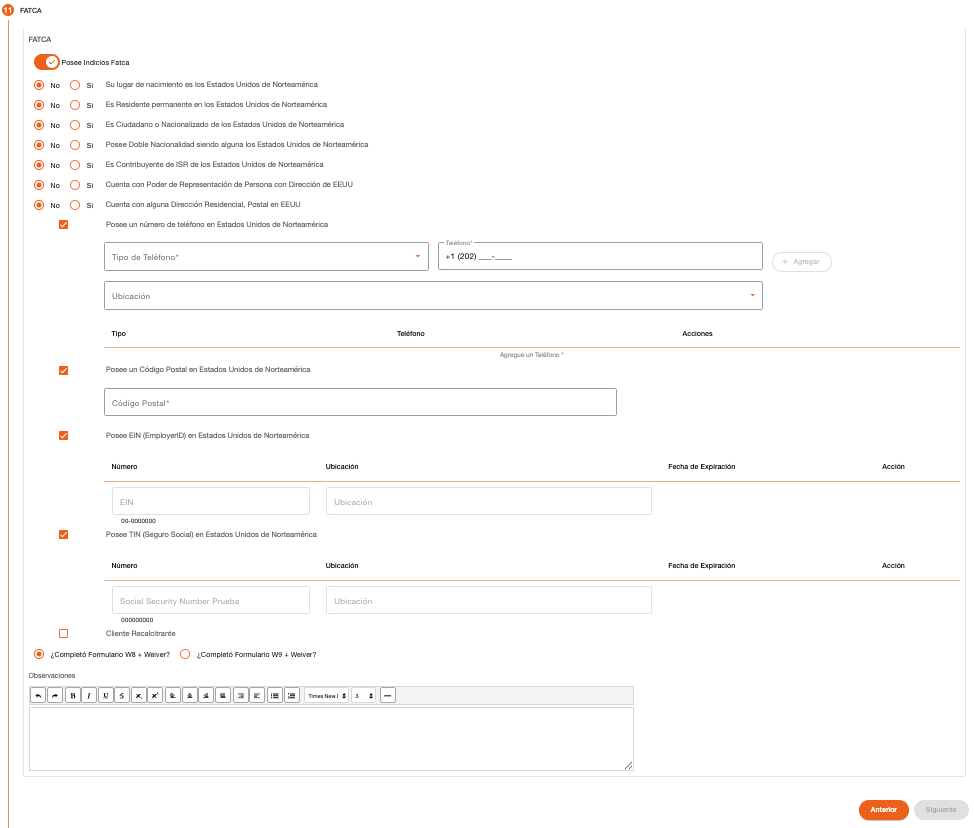

# FATCA – Persona Natural

Registro de los datos que permiten determinar si la persona es FATCA. Algunas preguntas son seleccionadas y protegidas de forma automática por el sistema en base a los datos ingresados en los pasos anteriores de creación de cliente. Es obligatoria la selección de las primeras siente preguntas. 

Algunas preguntas pueden requerir más información a detalle, al seleccionar estas preguntas se expande otro set de preguntas o muestra campos que son requeridos para completar la información de la pregunta. 

Después de la pregunta “Posee Indicios FATCA” es obligatorio responder las primeras 7 preguntas con Si o No, para que se habilite el botón Siguiente. 

| Campo | Descripción | Condición |
| :--- | :--- | :--- |
| **Posee Indicios FATCA** | Indica si posee algún indicio FATCA, automáticamente seleccionado en base a la selección de las siguientes preguntas. Se puede cambiar de forma manual. Por defecto se muestra con “No”. | Obligatoria |
| **Su lugar de nacimiento es los Estados Unidos de Norteamérica** | Automáticamente seleccionado cuando el campo País de Nacimiento en Datos Generales es EE. UU. | Obligatorio |
| **Es Residente permanente en los Estados Unidos de Norteamérica** | Automáticamente seleccionado cuando el campo País de Residencia en Datos Generales es EE. UU. | Obligatorio |
| **Es Ciudadano o Nacionalizado de los Estados Unidos de Norteamérica** | Automáticamente seleccionado cuando el campo Nacionalidad en Datos Generales es EE. UU. | Obligatorio |
| **Posee Doble Nacionalidad siendo alguna los Estados Unidos de Norteamérica** | Automáticamente seleccionado cuando el campo 2da. Nacionalidad en Datos Generales es EE. UU. | Obligatorio |
| **Es Contribuyente de ISR de los Estados Unidos de Norteamérica** | Seleccionar si es contribuyente de ISR en EE. UU. | Obligatorio |
| **Cuenta con Poder de Representación de Persona con Dirección de EEUU** | Seleccionar si es representante de alguna persona con dirección en EE. UU. | Obligatorio |
| **Cuenta con alguna Dirección Residencial, Postal en EEUU** | Seleccionar si posee una dirección residencial postal en EE. UU. | Obligatorio |
| **Dirección** | Indicar el detalle de la dirección que posee en EE. UU. | Obligatorio al seleccionar la pregunta |
| **Posee un número de teléfono en Estados Unidos de Norteamérica** | Seleccionar si posee un número de teléfono en EE. UU. | Opcional |
| **Tipo de Teléfono** | Indicar tipo de teléfono. | Obligatorio al seleccionar la pregunta |
| **Teléfono** | Indicar el número de teléfono. | Obligatorio al seleccionar la pregunta |
| **Posee un Código Postal en Estados Unidos de Norteamérica** | Seleccionar si posee un código postal en EE. UU. | Opcional |
| **Código Postal** | Indicar el código postal. | Obligatorio al seleccionar la pregunta |
| **Posee EIN (EmployerID) en Estados Unidos de Norteamérica** | Seleccionar si posee documento EIN en EE. UU. Requiere ingreso de datos del documento o autorización. | Opcional |
| **Número (EIN)** | Número de identificación del documento. Validado según tipo. | Obligatorio al seleccionar la pregunta |
| **Ubicación (EIN)** | Lugar de emisión del documento. Se puede recuperar automáticamente y proteger. | Obligatorio al seleccionar la pregunta |
| **Fecha de Expiración (EIN)** | Fecha de expiración del documento. No puede ser menor a la actual. | Obligatorio al seleccionar la pregunta |
| **Posee TIN (Seguro Social) en Estados Unidos de Norteamérica** | Seleccionar si posee documento TIN en EE. UU. Requiere ingreso de datos del documento o autorización. | Opcional |
| **Número (TIN)** | Número de identificación del documento. Validado según tipo. | Obligatorio al seleccionar la pregunta |
| **Ubicación (TIN)** | Lugar de emisión del documento. Se puede recuperar automáticamente y proteger. | Obligatorio al seleccionar la pregunta |
| **Fecha de Expiración (TIN)** | Fecha de expiración del documento. No puede ser menor a la actual. | Obligatorio al seleccionar la pregunta |
| **Cliente Recalcitrante** | Cliente que no quiso proporcionar ninguna información FATCA. | Opcional |
| **¿Completó Formulario W8 + Weiver?** | Selección automática basada en preguntas 6 en adelante. Requiere autorización si se fuerza manualmente. | Excluyente a pregunta W9 |
| **¿Completó Formulario W9 + Weiver?** | Selección automática basada en preguntas 1 a 5 seleccionadas con “Sí”. Requiere autorización si se fuerza manualmente. | Excluyente a pregunta W8 |
| **Observaciones** | Observaciones relacionadas a FATCA. | Opcional |

[← Volver a página anterior](crear-cliente-natural.md)

