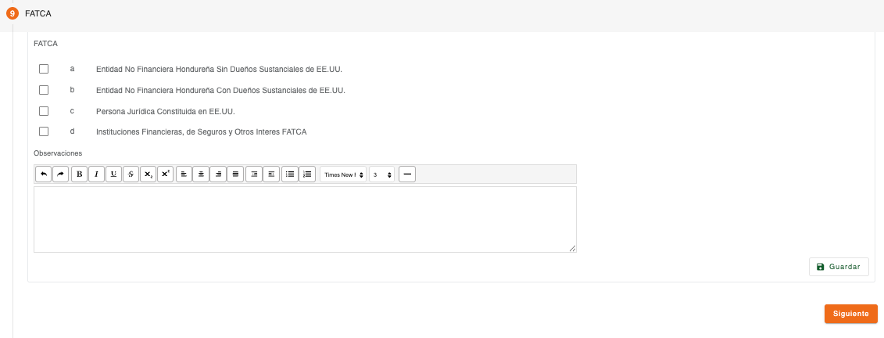

# FATCA - Persona Jurídica

Registro de los datos que permiten determinar si la persona jurídica es FATCA. El ingreso de estos datos es opcional, se puede continuar con el flujo de creación de clientes, sin ingresar estos datos.

Algunas preguntas pueden requerir más información a detalle, al seleccionar estas preguntas se expande otro set de preguntas o muestra campos que son requeridos para completar la información de la pregunta.

En algunas preguntas es requerido el ingreso de datos de documentos de identificación que corresponden a personas jurídicas identificadas como FATCA.

Los datos requeridos por tipo de documento de identificación pueden ser número de identificación, ubicación y fecha de expiración.

| Campo | Descripción | Condición |
| :--- | :--- | :--- |
| **Número** | Número de identificación del documento de la persona, el campo valida que sea ingresado en el formato configurado para el tipo de documento. | Obligatorio |
| **Ubicación** | No todos los documentos pueden requerir este dato, solo si el tipo de documento de identificación tiene configurado que requiere ubicación, será mostrado este campo. Permite indicar el lugar en donde fue emitido el documento de identificación, dependiendo de la configuración del tipo de documento puede recuperar estos datos de forma automática del número de identificación y proteger los datos de este campo para que no sean modificados. | Obligatorio. |
| **Fecha de Expiración** | No todos los documentos pueden requerir este dato, es mostrado solo si el tipo de documento de identificación tiene configurado que requiere fecha de expiración. Permite indicar la fecha en la que expira el documento de identificación, la fecha no puede ser menor a la fecha actual. | Obligatorio. |

El sistema realiza validaciones de lista de cautela por documento de identificación y muestra los mensajes correspondientes si encuentra la identificación en alguna lista de cautela (Notificación, Solicitar Autorización, Detener). 

Del listado de tipos de documentos mostrado, hay algunos que son requeridos y otros son opcionales, esto depende como están definidos los parámetros de tipos de documentos por rol de persona, en este caso el rol “FATCA_JURIDICO”. Si falta un tipo de documento de identificación que es requerido en esta sección, muestra un dialogo de solicitud de credenciales, para autorizar la continuidad del flujo, sin haber ingresado el tipo de documento requerido.

[← Volver a página anterior](crear-cliente-juridica.md)