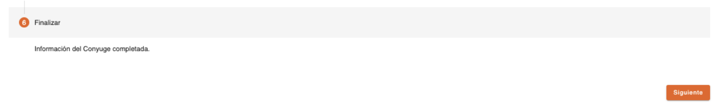

# Finalizar – PEP Cónyuge

Este es el último paso en la creación del cónyuge de la persona PEP, se finaliza la captura de datos y se realiza la relación entre ambas personas como cónyuges. 

[Volver a página anterior](pep-conyuge.md)