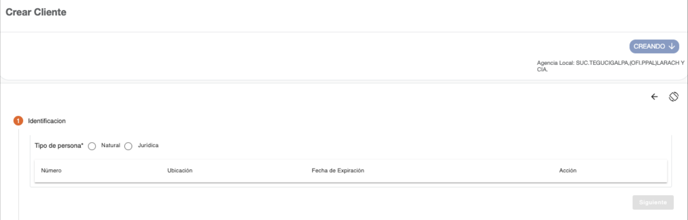
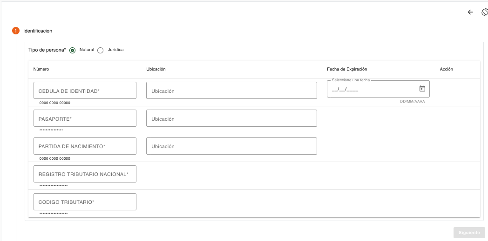
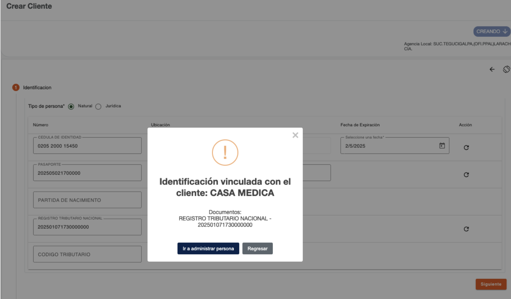

## Identificación persona natural

Al seleccionar la opción Cliente del botón Agregar en la Búsqueda de Clientes, se muestra el primer paso para la creación de clientes, en donde se solicitan los datos de los documentos de identificación de la persona. 

Es necesario indicar el tipo de persona con el que será creado el cliente, dependiendo del tipo de persona seleccionado, será mostrada la lista de tipos de documentos de identificación que puede presentar la persona para identificarse. 

Del listado de tipos de documentos mostrado, hay algunos que son requeridos y otros son opcionales, esto depende de cómo están definidos los parámetros de tipos de documentos por rol de persona “CLIENTE”.  

Es necesario el ingreso de por lo menos un documento de identificación, si no se ingresan los datos de documentos de identificación requeridos, el sistema muestra un dialogo de solicitud de credenciales, para autorizar la continuidad del flujo. 

Los datos requeridos por tipo de documento de identificación pueden ser número de identificación, ubicación y fecha de expiración. 

| Campo | Descripción | Condición |
| :--- | :--- | :--- |
| **Número** | Número de identificación de la persona, el campo valida que sea ingresado en el formato configurado para el tipo de documento. En base a este número de identificación, el sistema puede recuperar datos que son validados en los parámetros de ubicaciones geográficas o validar el año de nacimiento. | Es necesario ingresar al menos un documento de identificación. |
| **Ubicación** | No todos los documentos pueden requerir este dato; solo si el tipo de documento de identificación tiene configurado que requiere ubicación, será mostrado este campo. Permite indicar el lugar en donde fue emitido el documento de identificación, dependiendo de la configuración del tipo de documento, puede recuperar estos datos de forma automática del número de identificación y proteger los datos de este campo para que no sean modificados. | Obligatorio si es ingresado el número de identificación. |
| **Fecha de expiración** | No todos los documentos pueden requerir este dato, solo si el tipo de documento de identificación tiene configurado que requiere fecha de expiración, será mostrado este campo. Permite indicar la fecha en la que expira el documento de identificación; la fecha no puede ser menor a la fecha actual. | Obligatorio si es ingresado el número de identificación. |

El sistema realiza validaciones de lista de cautela por documento de identificación y muestra los mensajes correspondientes si encuentra la identificación en alguna lista de cautela (Notificación, Solicitar Autorización, Detener). 

Es necesario ingresar por lo menos los datos de un tipo de documento para habilitar el botón Siguiente. 

### Mensajes de error

| Campo | Descripción |
| :--- | :--- |
| **La entrada está incompleta** | No ha sido ingresada la información completamente conforme al formato esperado de la identificación. |
| **Ubicación requerida** | Debe seleccionar de la lista seleccionable, el lugar de emisión del documento de identificación. |
| **Documento de un tercero** | El documento de identificación ya existe relacionado a una persona creada en el sistema. |

#### Documento de identificación existe

El sistema valida cada número de identificación ingresado, para determinar si está relacionado a alguna persona existente, mostrando el mensaje correspondiente. En donde el usuario puede Cancelar y corregir el número de identificación o ir a la opción de administrar persona para consultar la información, saliendo del flujo de creación de cliente. 

#### Autorización por Documento Requerido

Cuando falta un tipo de documento de identificación que es requerido, muestra un dialogo de solicitud de credenciales, para autorizar la continuidad del flujo sin haber ingresado el tipo de documento requerido. La solicitud puede ser autorizada de forma local o remota, dependiendo del nivel de permisos que tenga asignados el usuario y el que requiere la autorización.  

{ width=100% }

---

[← Volver a página anterior](crear-cliente-natural.md)

