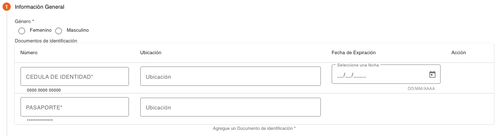
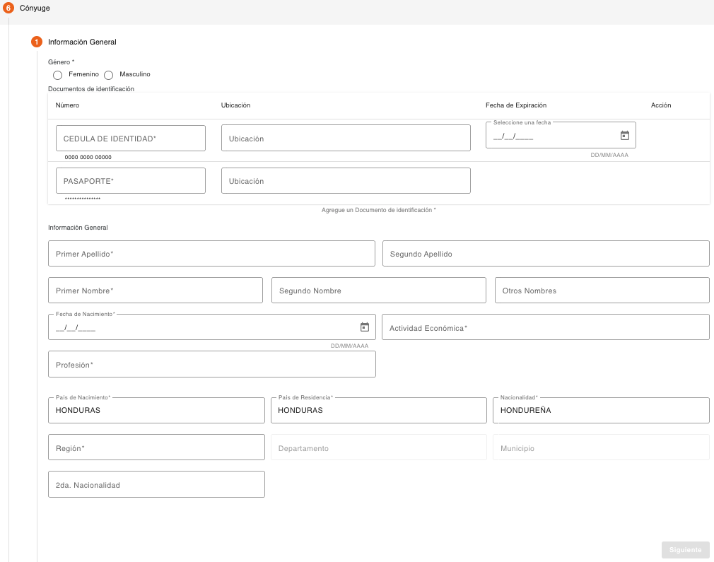
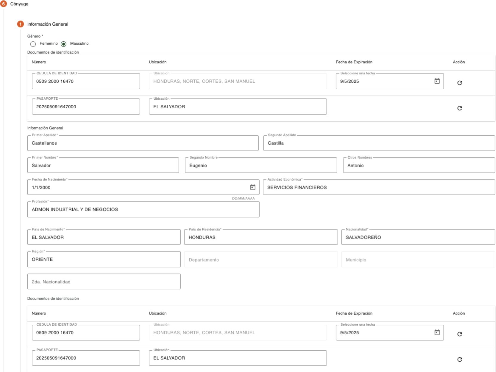

# Información General – PEP Cónyuge

Permite capturar la información general del cónyuge de la persona PEP, el primer campo que se debe indicar es el género. (Femenino/Masculino) Después de este campo, es requerido el ingreso de documentos de identificación de la persona. 

Del listado de tipos de documentos mostrado, hay algunos que son requeridos y otros son opcionales, esto depende de cómo están definidos los parámetros de tipos de documentos por rol de persona “CONYUGE”.  

Es necesario el ingreso de por lo menos un documento de identificación, si no se ingresan los datos de documentos de identificación requeridos, el sistema muestra un dialogo de solicitud de credenciales, para autorizar la continuidad del flujo, sin haber ingresado el tipo de documento requerido.  

Los datos requeridos por tipo de documento de identificación pueden ser número de identificación, ubicación y fecha de expiración. 

| Campo | Descripción | Condición |
| :--- | :--- | :--- |
| **Número** | Número de identificación de la persona, el campo valida que sea ingresado en el formato configurado para el tipo de documento. En base a este número de identificación el sistema puede recuperar datos que son validados en los parámetros de ubicaciones geográficas o validar el año de nacimiento. | Es necesario ingresar al menos un documento de identificación. |
| **Ubicación** | No todos los documentos pueden requerir este dato, solo si el tipo de documento de identificación tiene configurado que requiere ubicación, será mostrado este campo. Permite indicar el lugar en donde fue emitido el documento de identificación, dependiendo de la configuración del tipo de documento puede recuperar estos datos de forma automática del número de identificación y proteger los datos de este campo para que no sean modificados. | Obligatorio si es ingresado el número de identificación. |
| **Fecha de Expiración** | No todos los documentos pueden requerir este dato, solo si el tipo de documento de identificación tiene configurado que requiere fecha de expiración, será mostrado este campo. Permite indicar la fecha en la que expira el documento de identificación, la fecha no puede ser menor a la fecha actual. | Obligatorio si es ingresado el número de identificación. |

El sistema realiza validaciones de lista de cautela por documento de identificación y muestra los mensajes correspondientes si encuentra la identificación en alguna lista de cautela (Notificación, Solicitar Autorización, Detener). 

Al indicar los datos de un documento de identificación de una persona que ya existe en el sistema, serán recuperados los datos que tiene registrados los cuales se mostrarán protegidos en los siguientes pasos, solo se muestran habilitados los campos de información que no tiene grabada la persona. 

Después de ingresar los datos de identificaciones, es requerido el ingreso de la información general de la persona. 

| Campo | Descripción | Condición |
| :--- | :--- | :--- |
| **Género** | Indica si la persona es de género masculino o femenino. | Obligatorio |
| **Primer Apellido** | Primer apellido de la persona. | Obligatorio |
| **Segundo Apellido** | Segundo apellido de la persona. | Opcional |
| **Primer Nombre** | Primer nombre de la persona. | Obligatorio |
| **Segundo Nombre** | Segundo nombre de la persona. | Opcional |
| **Otros Nombres** | Otros nombres de la persona. | Opcional |
| **Fecha de Nacimiento** | Fecha de nacimiento que indica el documento de identificación. El sistema valida que esta fecha coincida con el formato del número de identificación. En base a esta fecha se determina si la persona es menor de edad y evaluar si es necesario autorizar la creación de la persona. | Obligatorio |
| **Actividad Económica** | Actividad económica a la que se dedica la persona. | Obligatorio |
| **Fecha de Actividad Económica** | Fecha de inicio de actividad económica. Este campo es mostrado solo si la actividad económica tiene configurado que requiere fecha. | Obligatorio |
| **Profesión** | Profesión actual de la persona. | Obligatorio |
| **Fecha de Profesión** | Fecha de inicio de profesión. Este campo es mostrado solo si la profesión tiene configurado que requiere fecha. | Obligatorio |
| **País de Nacimiento** | País en el que nació la persona de acuerdo con la identificación. | Obligatorio |
| **País de Residencia** | País en el que reside actualmente la persona. | Obligatorio |
| **Nacionalidad** | Nacionalidad que indica el documento de identificación. | Obligatorio |
| **Región** | Región en donde nació la persona, este campo se habilita solo si el país de nacimiento tiene regiones configuradas. | Obligatorio |
| **Departamento** | Departamento en donde nació la persona, este campo se habilita solo si el país de nacimiento tiene departamentos configurados. | Obligatorio |
| **Municipio** | Municipio en donde nació la persona, este campo se habilita solo si el país de nacimiento tiene municipios configurados. | Obligatorio |
| **2da. Nacionalidad** | Segunda nacionalidad que indica el documento de identificación. | Opcional |

Cuando la persona reside en el extranjero o tiene una nacionalidad extranjera, será requerido indicar los documentos de identificación correspondientes, estos pueden variar dependiendo si es de Estados Unidos o de algún otro país. Si en los pasos anteriores fueron indicados los datos de estos documentos de identificación, serán recuperados y mostrados con los campos protegidos. Esta sección se muestra solo si los datos de nacionalidad y residencia son de un país diferente al país local. 

Los datos requeridos por tipo de documento de identificación pueden ser número de identificación, ubicación y fecha de expiración. 

| Campo | Descripción | Condición |
| :--- | :--- | :--- |
| **Número** | Número de documento de identificación de la persona, el campo valida que sea ingresado en el formato configurado para el tipo de documento. | Es necesario ingresar al menos un documento de identificación. |
| **Ubicación** | No todos los documentos pueden requerir este dato, solo si el tipo de documento de identificación tiene configurado que requiere ubicación, será mostrado este campo. Permite indicar el lugar en donde fue emitido el documento, y puede ser protegido automáticamente. | Obligatorio al ingresar el número de identificación. |
| **Fecha de Expiración** | No todos los documentos pueden requerir este dato, es mostrado solo si el tipo de documento tiene configurado que requiere fecha de expiración. Permite indicar la fecha en que expira el documento; la fecha no puede ser menor a la fecha actual. | Obligatorio al ingresar el número de identificación. |

Del listado de tipos de documentos mostrado, hay algunos que son requeridos y otros son opcionales, esto depende como están definidos los parámetros de tipos de documentos por rol de persona, en este caso los roles “CLIENTE_ FATCA” para Estados Unidos o “CLIENTE_INTER” para cualquier otro país. Si falta un tipo de documento de identificación que es requerido en esta sección, muestra un dialogo de solicitud de credenciales, para autorizar la continuidad del flujo, sin haber ingresado el tipo de documento requerido. 

Es necesario indicar todos los datos obligatorios para habilitar el botón Siguiente. 

**Validación Listas de Cautela**

El sistema valida si el documento de identificación o el nombre de la persona se encuentran registrados en alguna lista de cautela, dependiendo del tipo de lista puede ser solo un mensaje informativo, puede requerir credenciales para autorizar la continuidad del flujo o detener la operación y no permitir continuar con el flujo. 

[Volver a página anterior](pep-conyuge.md)