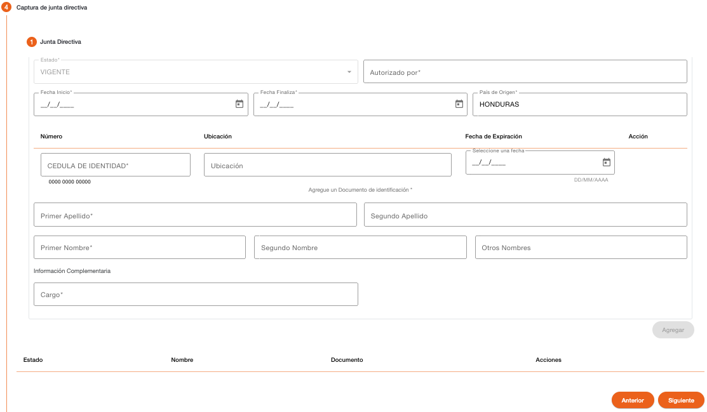

# Junta Directiva - Persona Jurídica

Registro de los miembros de junta directiva que posee la organización. Esta sección es opcional, no es obligatoria la creación de miembros de junta directiva.

Hay que considerar que en base al documento de identificación el sistema valida si la persona ya existe en el sistema, si la persona existe, recupera los datos de la persona mostrándolos protegidos, solo los datos que no existen se muestran habilitados para completar la información requerida.

| Campo | Descripción | Condición |
| :--- | :--- | :--- |
| **Estado** | Estado del miembro de junta, por defecto es activo. Al darle de baja es inactivo. | Protegido |
| **Autorizado por** | Indica la entidad que autoriza el miembro de junta directiva. | Obligatorio |
| **Fecha Inicio** | Fecha en que inicia como miembro de junta directiva. | Obligatorio |
| **Fecha Finaliza** | Fecha en que finaliza como miembro de junta directiva. | Opcional |
| **País de Origen** | País de origen de la persona. | Obligatorio |
| **Número** | Número de identificación de la persona, el campo valida que sea ingresado en el formato configurado para el tipo de documento. En base a este número de identificación el sistema puede recuperar datos que son validados en los parámetros de ubicaciones geográficas o validar el año de nacimiento. | Es necesario ingresar al menos un documento de identificación. |
| **Ubicación** | No todos los documentos pueden requerir este dato, solo si el tipo de documento de identificación tiene configurado que requiere ubicación, será mostrado este campo. Permite indicar el lugar en donde fue emitido el documento de identificación, dependiendo de la configuración del tipo de documento puede recuperar estos datos de forma automática del número de identificación y proteger los datos de este campo para que no sean modificados. | Obligatorio si es ingresado el número de identificación. |
| **Fecha de Expiración** | No todos los documentos pueden requerir este dato, solo si el tipo de documento de identificación tiene configurado que requiere fecha de expiración, será mostrado este campo. Permite indicar la fecha en la que expira el documento de identificación, la fecha no puede ser menor a la fecha actual. | Obligatorio si es ingresado el número de identificación. |
| **Primer Apellido** | Primer apellido de la persona. | Obligatorio |
| **Segundo Apellido** | Segundo apellido de la persona. | Opcional |
| **Primer Nombre** | Primer nombre de la persona. | Obligatorio |
| **Segundo Nombre** | Segundo nombre de la persona. | Opcional |
| **Otros Nombres** | Otros nombres de la persona. | Opcional |
| **Cargo** | Indica el cargo que ocupa el miembro de junta directiva. | Obligatorio |

Es necesario indicar todos los datos obligatorios para habilitar el botón Siguiente.

El sistema realiza validaciones de lista de cautela por documento de identificación y muestra los mensajes correspondientes si encuentra la identificación en alguna lista de cautela (Notificación, Solicitar Autorización, Detener). 

[← Volver a página anterior](crear-cliente-juridica.md)