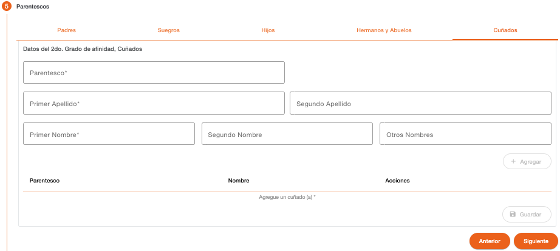

# Cuñados

Permite registrar la información de los hermanos del cónyuge de la persona PEP, la creación de estos parentescos es opcional. 

| Campo | Descripción | Condición |
| :--- | :--- | :--- |
| **Parentesco** | Parentesco al que corresponde la información. | Obligatorio |
| **Primer Apellido** | Primer apellido de la persona. | Obligatorio |
| **Segundo Apellido** | Segundo apellido de la persona. | Opcional |
| **Primer Nombre** | Primer nombre de la persona. | Obligatorio |
| **Segundo Nombre** | Segundo nombre de la persona. | Opcional |
| **Otros Nombres** | Otros nombres de la persona. | Opcional |

[Volver a página anterior](pep-parentescos.md)