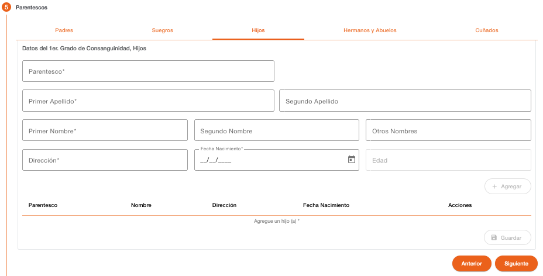

# Hijos

Permite registrar la información de los hijos de la persona PEP. La creación de estos parentescos es opcional.

| Campo | Descripción | Condición |
| :--- | :--- | :--- |
| **Parentesco** | Parentesco al que corresponde la información. | Obligatorio |
| **Primer Apellido** | Primer apellido de la persona. | Obligatorio |
| **Segundo Apellido** | Segundo apellido de la persona. | Opcional |
| **Primer Nombre** | Primer nombre de la persona. | Obligatorio |
| **Segundo Nombre** | Segundo nombre de la persona. | Opcional |
| **Otros Nombres** | Otros nombres de la persona. | Opcional |
| **Dirección** | Texto descriptivo de la dirección de la persona. | Requerido |
| **Fecha Nacimiento** | Fecha de nacimiento de la persona. | Requerido |
| **Edad** | Muestra la edad de la persona en base a la fecha de nacimiento. | Protegido |

---

[← Volver a PEP Parentescos](pep-parentescos.md)