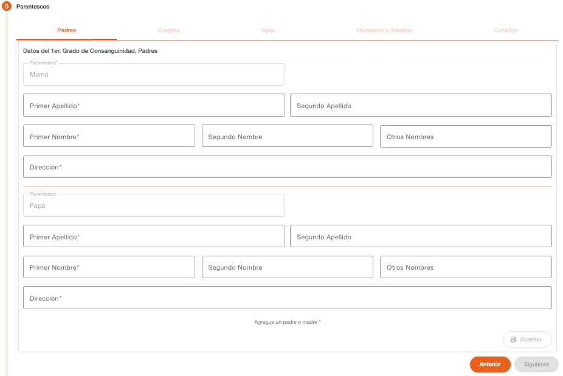

# Padres

Permite registrar la información de los padres de la persona PEP, es obligatorio el ingreso de por lo menos uno de los dos padres para habilitar las siguientes secciones de parentescos o continuar con los siguientes pasos del flujo de creación de clientes. 

La pantalla incluye una sección para el parentesco de la madre y una sección para el parentesco del padre, los datos solicitados son los mismos para ambos padres. 

| Campo | Descripción | Condición |
| :--- | :--- | :--- |
| **Parentesco** | Parentesco al que corresponde la información. | Campo protegido |
| **Primer Apellido** | Primer apellido de la persona. | Obligatorio |
| **Segundo Apellido** | Segundo apellido de la persona. | Opcional |
| **Primer Nombre** | Primer nombre de la persona. | Obligatorio |
| **Segundo Nombre** | Segundo nombre de la persona. | Opcional |
| **Otros Nombres** | Otros nombres de la persona. | Opcional |
| **Dirección** | Texto descriptivo de la dirección de la persona. | Obligatorio |

---

[← Volver a PEP Parentescos](pep-parentescos.md)