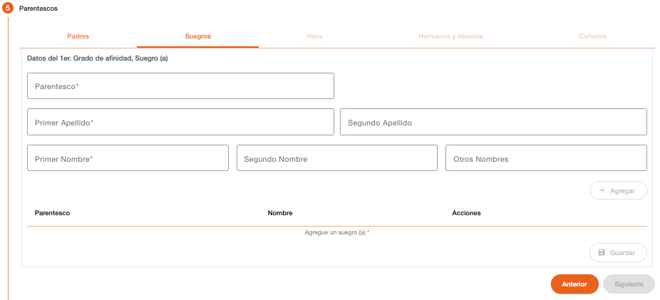

# Suegros

Permite registrar la información de los suegros de la persona PEP, cuando el estado civil de la persona es casado, es obligatorio el ingreso de por lo menos uno de los dos padres del cónyuge, para habilitar las siguientes secciones de parentescos o continuar con los siguientes pasos del flujo de creación de clientes. 

Es creado un registro para el parentesco de la suegra y un registro para el parentesco del suegro, los datos solicitados son los mismos para ambos.

| Campo | Descripción | Condición |
| :--- | :--- | :--- |
| **Parentesco** | Parentesco al que corresponde la información. | Obligatorio |
| **Primer Apellido** | Primer apellido de la persona. | Obligatorio |
| **Segundo Apellido** | Segundo apellido de la persona. | Opcional |
| **Primer Nombre** | Primer nombre de la persona. | Obligatorio |
| **Segundo Nombre** | Segundo nombre de la persona. | Opcional |
| **Otros Nombres** | Otros nombres de la persona. | Opcional |

---

[← Volver a PEP Parentescos](pep-parentescos.md)