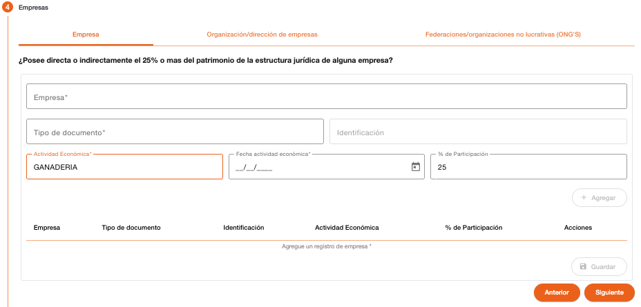
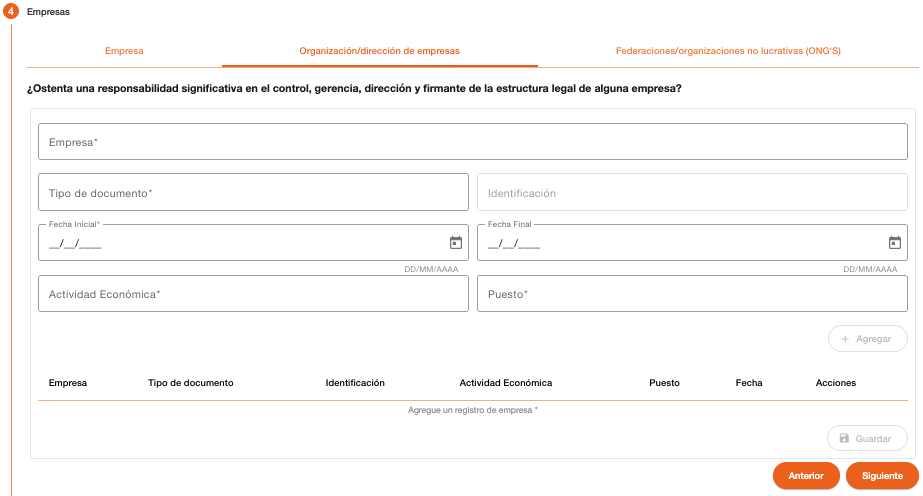
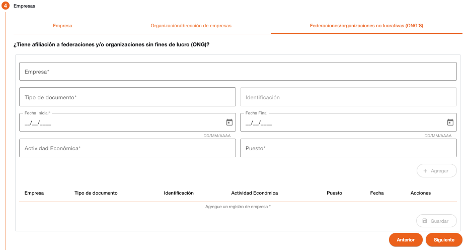

# PEP Empresas - Persona natural

Permite registrar la información de las empresas en las cuales la persona PEP tiene alguna participación como accionista, un puesto significante en la dirección de una empresa o posee afiliación en empresas no lucrativas. Se debe ingresar información solo en las secciones en donde la persona PEP tiene relación con alguna empresa. 

La creación de registros en estas secciones no es obligatoria, es permitido utilizar el botón **Siguiente** para continuar con el próximo paso. 

## Empresas

Sección para agregar las empresas en las que la persona PEP tiene algún porcentaje de participación como accionista. 

| Campo | Descripción | Condición |
| :--- | :--- | :--- |
| **Empresa** | Nombre de la empresa en donde la persona PEP posee un porcentaje de participación como accionista. Al ingresar el nombre, el sistema sugiere el listado de empresas (persona jurídica) que ya están registradas en el sistema con ese nombre, para que pueda ser seleccionado, de lo contrario se puede crear una nueva. | Opcional. |
| **Tipo de Documento** | Tipo de documento con el que se identifica la empresa. El campo muestra una lista desplegable de tipos de documento. | Obligatorio al ingresar empresa. |
| **Identificación** | Número con el que se identifica la empresa, relacionado al tipo de documento seleccionado. | Obligatorio al ingresar empresa. |
| **Actividad Económica** | Actividad económica a la que se dedica la empresa. El campo muestra una lista desplegable de actividades. | Obligatorio al ingresar empresa. |
| **Fecha Actividad Económica** | Fecha de inicio de actividad económica. Este campo es mostrado solo si la actividad económica tiene configurado que requiere fecha. | Obligatorio |
| **% de Participación** | Porcentaje de participación que la persona tiene como accionista en la empresa. | Obligatorio al ingresar empresa. |

---

## Organización/Dirección de Empresas

Sección para agregar las empresas en las que la persona PEP ocupa un puesto significativo de control, gerencia, dirección o firmante dentro de la empresa. 

| Campo | Descripción | Condición |
| :--- | :--- | :--- |
| **Empresa** | Nombre de la empresa en donde la persona PEP posee un puesto significativo en la organización o dirección. Al ingresar el nombre, el sistema sugiere el listado de empresas (persona jurídica) que ya están registradas en el sistema con ese nombre, para que pueda ser seleccionado, de lo contrario se puede crear una nueva. | Opcional. |
| **Tipo de Documento** | Tipo de documento con el que se identifica la empresa. El campo muestra una lista desplegable de tipos de documento. | Obligatorio al ingresar empresa. |
| **Identificación** | Número con el que se identifica la empresa, relacionado al tipo de documento seleccionado. | Obligatorio al ingresar empresa. |
| **Fecha Inicial** | Fecha a partir de la cual ocupa el puesto en la empresa. | Obligatorio al ingresar empresa. |
| **Fecha Final** | Fecha de finalización del puesto en la empresa. | Opcional |
| **Actividad Económica** | Actividad económica a la que se dedica la empresa. El campo muestra una lista desplegable de actividades. | Obligatorio al ingresar empresa. |
| **Fecha Actividad Económica** | Fecha de inicio de actividad económica. Este campo es mostrado solo si la actividad económica tiene configurado que requiere fecha. | Obligatorio |
| **Puesto** | Puesto que ocupa dentro de la organización o dirección de la empresa. | Obligatorio al ingresar empresa. |

---

## ONG’s

Sección para agregar las empresas sin fines de lucro en las que la persona PEP posee alguna afiliación. 

| Campo | Descripción | Condición |
| :--- | :--- | :--- |
| **Empresa** | Nombre de la empresa en donde la persona PEP posee afiliación. Al ingresar el nombre, el sistema sugiere el listado de empresas (persona jurídica) que ya están registradas en el sistema con ese nombre, para que pueda ser seleccionado, de lo contrario se puede crear una nueva. | Opcional. |
| **Tipo de Documento** | Tipo de documento con el que se identifica la empresa. El campo muestra una lista desplegable de tipos de documento. | Obligatorio al ingresar empresa. |
| **Identificación** | Número con el que se identifica la empresa, relacionado al tipo de documento seleccionado. | Obligatorio al ingresar empresa. |
| **Fecha Inicial** | Fecha a partir de la cual ocupa el puesto en la empresa. | Obligatorio al ingresar empresa. |
| **Fecha Final** | Fecha de finalización del puesto en la empresa. | Opcional |
| **Actividad Económica** | Actividad económica a la que se dedica la empresa. El campo muestra una lista desplegable de actividades. | Obligatorio al ingresar empresa. |
| **Fecha Actividad Económica** | Fecha de inicio de actividad económica. Este campo es mostrado solo si la actividad económica tiene configurado que requiere fecha. | Obligatorio |
| **Puesto** | Puesto que ocupa dentro de la organización o dirección de la empresa. | Obligatorio al ingresar empresa. |

---

[← Volver a página anterior](crear-cliente-natural.md)
