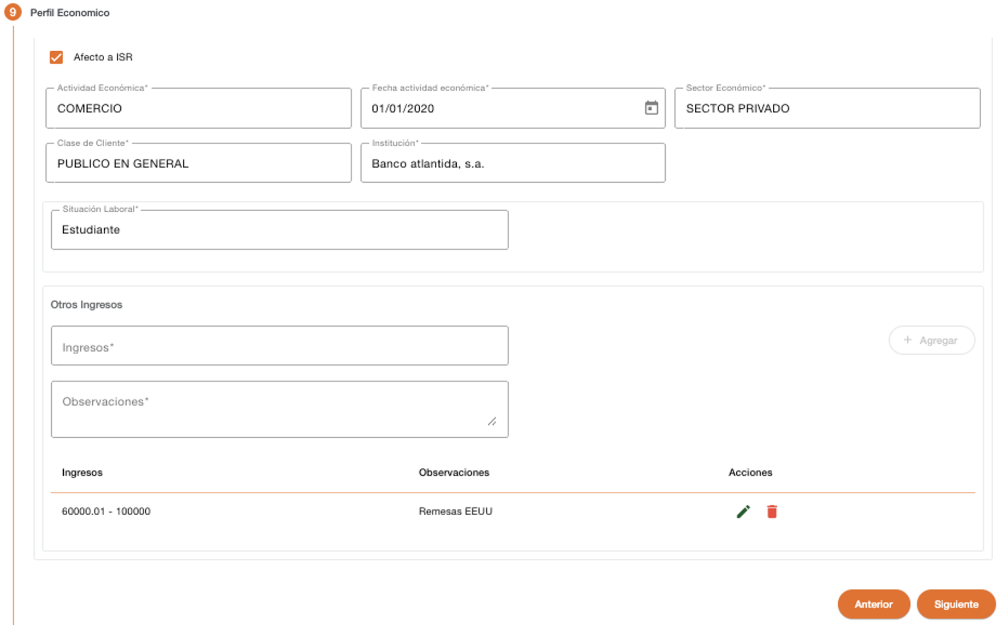
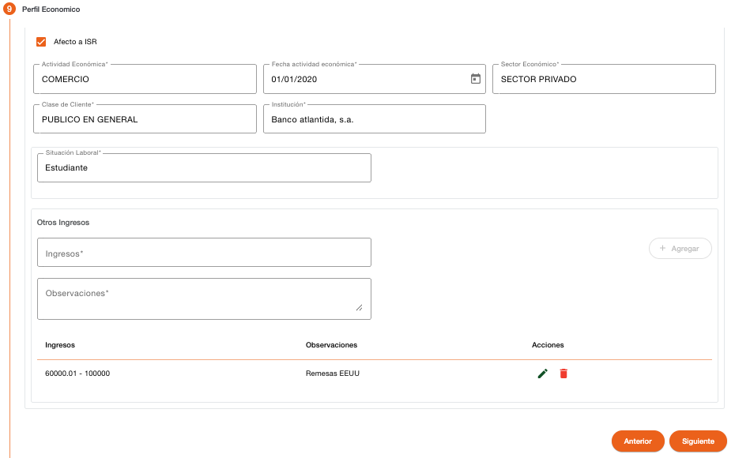

# Perfil Económico – Persona Natural

Registro de los datos que permite clasificar a la persona con un perfil económico.  

| Campo | Descripción | Condición |
| :--- | :--- | :--- |
| **Afecto ISR** | Indica si la persona es afecta a ISR, el sistema valida que tenga ingresado el documento de identificación. Si no es afecto a ISR será requerida una autorización. | Obligatorio |
| **Actividad Económica** | Actividad económica a la que se dedica la persona. | Obligatorio |
| **Fecha Actividad Económica** | Fecha de inicio de la actividad económica. Se muestra solo cuando la actividad económica tiene configurado que requiere fecha. | Obligatorio |
| **Sector Económico** | Sector económico al que pertenece la persona. | Obligatorio |
| **Clase de Cliente** | Clase de cliente con el que es clasificada la persona. | Obligatorio |
| **Situación Laboral** | Situación laboral de la persona. En base a este dato, el sistema va a solicitar datos adicionales, como referencia laborales o datos de negocio cuando es comerciante. | Obligatorio |

### Otros ingresos
La sección de Otros ingresos permite indicar el detalle de los ingresos adicionales que recibe la persona. Esta sección es opcional. 

| Campo | Descripción | Condición |
| :--- | :--- | :--- |
| **Ingresos** | Indica el rango de los montos de ingresos que recibe la persona. | Obligatorio |
| **Observaciones** | Texto descriptivo del origen de los ingresos. | Obligatorio |

[← Volver a página anterior](crear-cliente-natural.md)

