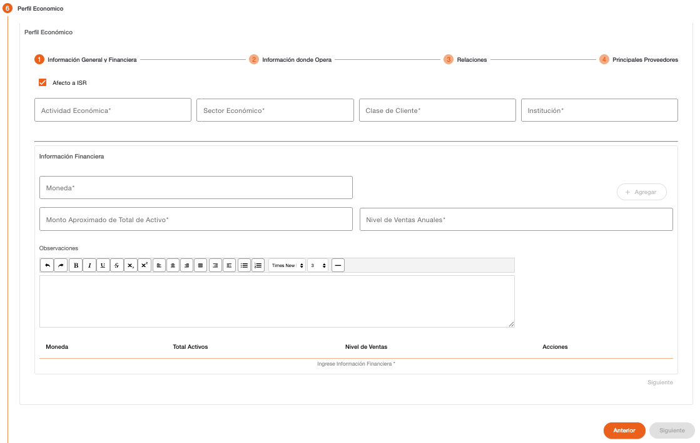
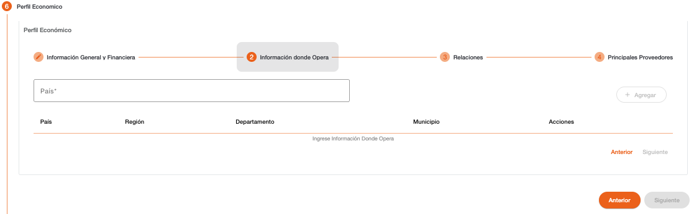
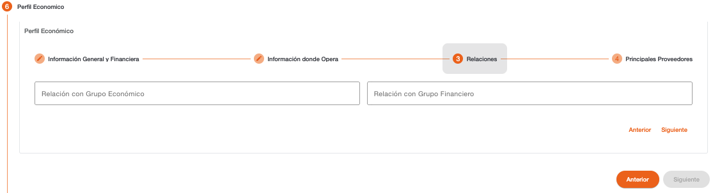
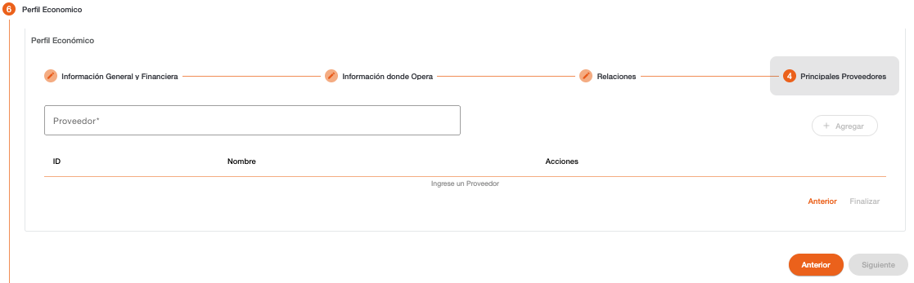

# Perfil Económico - Persona Jurídica

Registro de los datos que permite clasificar a la persona jurídica con un perfil económico. El ingreso de datos en esta sección es obligatorio para continuar con el flujo de creación de cliente.

El perfil económico de una persona jurídica está dividido en cuatro secciones, información general y financiera, información de donde opera la institución, relaciones con grupos económicos o financieros y registro de proveedores principales.

### Información General y Financiera – Perfil Económico

La información general corresponde a los datos que permiten identificar el perfil económico general de la persona jurídica.

| Campo | Descripción | Condición |
| :--- | :--- | :--- |
| **Afecto ISR** | Indica si la persona es afecta a ISR, el sistema valida que tenga ingresado el documento de identificación. Si no es afecto a ISR será requerida una autorización. | Obligatorio |
| **Actividad Económica** | Actividad económica a la que se dedica la persona jurídica. | Obligatorio |
| **Fecha Actividad Económica** | Fecha de inicio de la actividad económica. Se muestra solo cuando la actividad económica tiene configurado que requiere fecha. | Obligatorio |
| **Sector Económico** | Sector económico al que pertenece la persona jurídica. | Obligatorio |
| **Clase de Cliente** | Clase de cliente con el que es clasificada la persona jurídica. | Obligatorio |

La sección de información financiera corresponde al total de activos y ventas anuales que percibe la institución. Es obligatorio el ingreso de un registro en la moneda local para continuar con el flujo. (Siguiente)

| Campo | Descripción | Condición |
| :--- | :--- | :--- |
| **Moneda** | Indica la moneda en la que están expresados los valores | Obligatorio |
| **Monto Aproximado de Total de Activos** | Valor del total de activos expresados en la moneda seleccionada. | Obligatorio |
| **Nivel de Ventas Anuales** | Valor de ventas anuales en la moneda seleccionada. | Obligatorio |
| **Observaciones** | Observaciones relacionadas a la información financiera. | Opcional |

### Información Donde Opera

Registro de los países o distribución geográfica local en donde tiene operaciones la institución, el registro de datos es opcional, se puede continuar con el flujo sin ingresar estos datos. (Siguiente)

| Campo | Descripción | Condición |
| :--- | :--- | :--- |
| **País** | Indica el país en donde tiene operaciones. | Obligatorio |
| **Región** | Región del país local en donde tiene operaciones. Este campo se habilita cuando el país es local. | Opcional |
| **Departamento** | Departamento del país local en donde tiene operaciones. | Opcional |
| **Municipio** | Municipio del país local en donde tiene operaciones. | Opcional |

### Relaciones Grupos Económicos / Financieros

Registro del grupo económico y/o financiero con los que tiene relación la institución, el registro de datos es opcional, se puede continuar con el flujo sin ingresar estos datos. (Siguiente)

| Campo | Descripción | Condición |
| :--- | :--- | :--- |
| **Relación con Grupo Económico** | Grupo económico con el que tiene relación la institución. | Opcional |
| **Relación con Grupo Financiero** | Grupo financiero con el que tiene relación la institución. | Opcional |

### Principales Proveedores

Registro de los principales proveedores de la institución, el registro de datos es obligatorio, no se puede continuar con el flujo sin agregar proveedores. (Finalizar)

| Campo | Descripción | Condición |
| :--- | :--- | :--- |
| **Proveedor** | Proveedor con el que tiene relación la institución. Al ingresar el nombre del proveedor el sistema realiza una búsqueda de las personas existentes y muestra una lista seleccionable de las personas que coinciden con el texto. | Obligatorio |

[← Volver a página anterior](crear-cliente-juridica.md)

