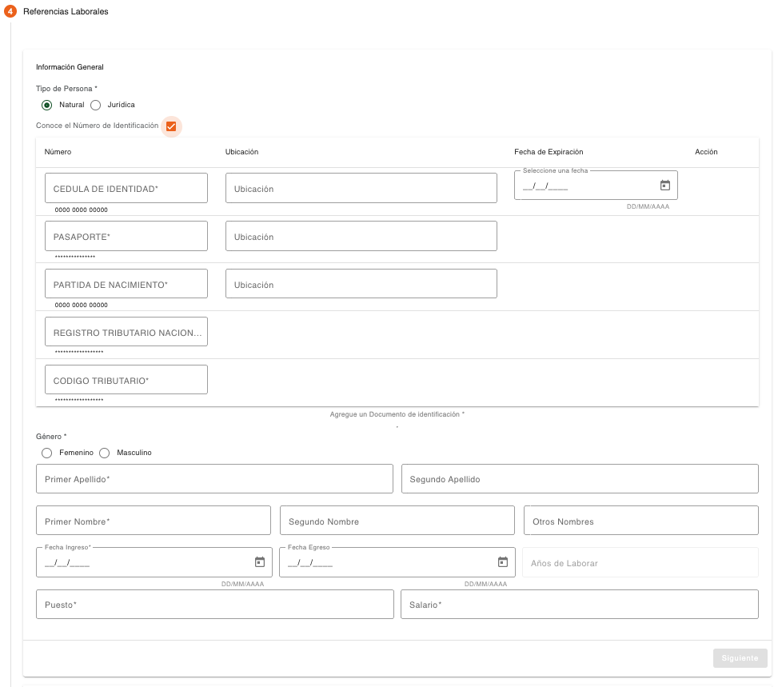
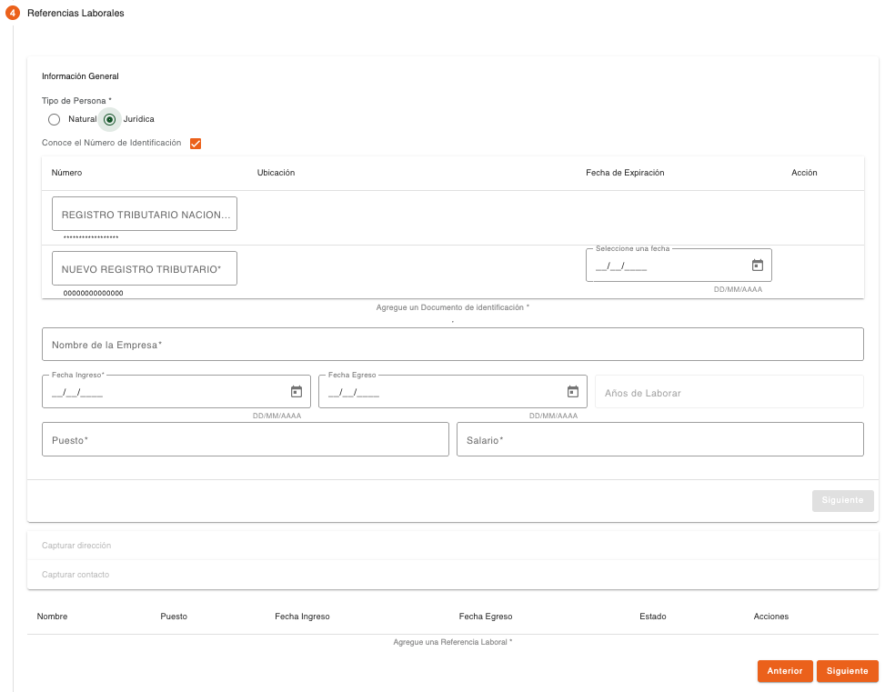
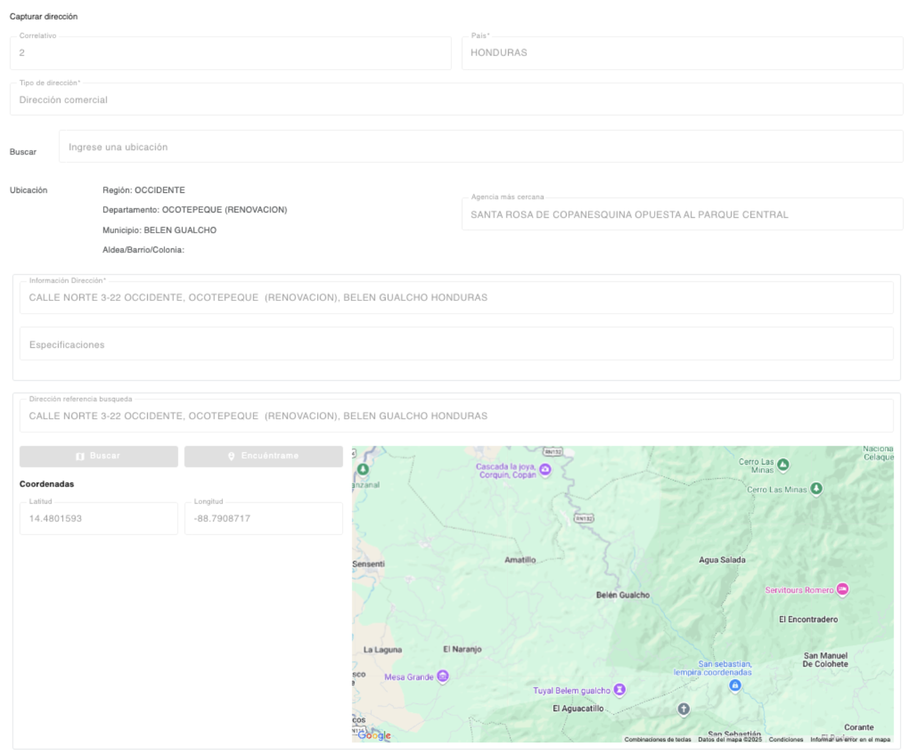

# Referencias Laborales – PEP Cónyuge

Registro de referencias laborales del cónyuge de la persona PEP, las referencias pueden ser de una persona natural o una persona jurídica. 

| Campo | Descripción | Condición |
| :--- | :--- | :--- |
| **Tipo de Persona** | Indica si la referencia laboral corresponde a una persona natural o persona jurídica. | Obligatorio |

En base a este campo se determinan los datos que serán requeridos para crear la referencia laboral. 

Para crear una referencia laboral es requerido indicar los datos generales, dirección y datos de contacto. 

## Natural - Datos Generales – Referencia Laboral – PEP Cónyuge 

Los datos generales para crear una referencia laboral de persona natural se muestran en una sola pantalla, en este documento se muestran separados para describir la funcionalidad. 

| Campo | Descripción | Condición |
| :--- | :--- | :--- |
| **Conoce el Número de Identificación** | Indica si la persona conoce el número de identificación de la referencia laboral. Al seleccionar, es desplegada la lista de tipos de documentos de identificación correspondientes al tipo de persona. | Opcional |

Los datos requeridos por tipo de documento de identificación pueden ser número de identificación, ubicación y fecha de expiración. 

| Campo | Descripción | Condición |
| :--- | :--- | :--- |
| **Número** | Número de identificación del documento de la persona, el campo valida que sea ingresado en el formato configurado para el tipo de documento. | Requerido al seleccionar el campo “Conoce el número de identificación.” |
| **Ubicación** | No todos los documentos pueden requerir este dato, solo si el tipo de documento tiene configurado que requiere ubicación, será mostrado este campo. Permite indicar el lugar de emisión y puede ser llenado automáticamente y protegido. | Obligatorio al ingresar el número de identificación. |
| **Fecha de Expiración** | Mostrado solo si el tipo de documento requiere fecha de expiración. | Opcional |

El sistema realiza validaciones de lista de cautela por documento de identificación y muestra los mensajes correspondientes si encuentra la identificación en alguna lista de cautela (Notificación, Solicitar Autorización, Detener). 

Si el número de documento de identificación ingresado existe registrado en el sistema, serán recuperados los datos de la persona con campos protegidos (Datos generales, Dirección, Contacto), serán habilitados solo los campos que no poseen información. 

Del listado de tipos de documentos mostrado, hay algunos que son requeridos y otros son opcionales, esto depende como están definidos los parámetros de tipos de documentos por rol de persona, en este caso los roles “CLIENTE” para persona natural o “EMPRESA” para para persona jurídica. Si falta un tipo de documento de identificación que es requerido en esta sección, muestra un dialogo de solicitud de credenciales, para autorizar la continuidad del flujo, sin haber ingresado el tipo de documento requerido. 

| Campo | Descripción | Condición |
| :--- | :--- | :--- |
| **Género** | Indica si la persona es de género masculino o femenino. | Obligatorio |
| **Primer Apellido** | Primer apellido de la persona. | Obligatorio |
| **Segundo Apellido** | Segundo apellido de la persona. | Opcional |
| **Primer Nombre** | Primer nombre de la persona. | Obligatorio |
| **Segundo Nombre** | Segundo nombre de la persona. | Opcional |
| **Otros Nombres** | Otros nombres de la persona. | Opcional |
| **Fecha Ingreso** | Fecha que inició a trabajar la persona. | Obligatorio |
| **Fecha Egreso** | Fecha que finalizó de trabajar la persona. | Opcional |
| **Años de Laborar** | Muestra los años laborados por la persona en base a la fecha de ingreso y egreso o fecha actual. | Protegido |
| **Puesto** | Puesto que ocupa la persona en este trabajo. | Obligatorio |
| **Salario** | Salario devengado por la persona en este trabajo. | Obligatorio |

**Jurídica - Datos Generales – Referencia Laboral – PEP Cónyuge**

Los datos generales para crear una referencia laboral de persona jurídica se muestran en una sola pantalla, en este documento se muestran separados para describir la funcionalidad. 

| Campo | Descripción | Condición |
| :--- | :--- | :--- |
| **Conoce el Número de Identificación** | Indica si la persona conoce el número de identificación de la referencia laboral. Al seleccionar, se despliega la lista de tipos de documentos de identificación correspondientes al tipo de persona. | Opcional |

Los datos requeridos por tipo de documento de identificación pueden ser número de identificación, ubicación y fecha de expiración. 

| Campo | Descripción | Condición |
| :--- | :--- | :--- |
| **Número** | Número de identificación del documento de la persona, el campo valida que sea ingresado en el formato configurado para el tipo de documento. | Requerido al seleccionar el campo “Conoce el número de identificación.” |
| **Ubicación** | No todos los documentos pueden requerir este dato. Solo si el tipo de documento requiere ubicación, será mostrado este campo. Permite indicar el lugar de emisión y puede autocompletarse y protegerse. | Obligatorio al ingresar el número de identificación. |
| **Fecha de Expiración** | Mostrado solo si el tipo de documento requiere fecha de expiración. Permite indicar la fecha de expiración, la cual no puede ser menor a la fecha actual. | Obligatorio al ingresar el número de identificación. |

Si el número de documento de identificación ingresado existe registrado en el sistema, serán recuperados los datos de la persona con campos protegidos (Datos generales, Dirección, Contacto), serán habilitados solo los campos que no poseen información. 

Del listado de tipos de documentos mostrado, hay algunos que son requeridos y otros son opcionales, esto depende como están definidos los parámetros de tipos de documentos por rol de persona, en este caso los roles “CLIENTE” para persona natural o “EMPRESA” para para persona jurídica. Si falta un tipo de documento de identificación que es requerido en esta sección, muestra un dialogo de solicitud de credenciales, para autorizar la continuidad del flujo, sin haber ingresado el tipo de documento requerido. 

| Campo | Descripción | Condición |
| :--- | :--- | :--- |
| **Nombre de la Empresa** | Nombre de la empresa. | Obligatorio |
| **Fecha Ingreso** | Fecha que inició a trabajar la persona. | Obligatorio |
| **Fecha Egreso** | Fecha que finalizó de trabajar la persona. | Opcional |
| **Años de Laborar** | Muestra los años laborados por la persona en base a la fecha de ingreso y egreso o fecha actual. | Protegido |
| **Puesto** | Puesto que ocupa la persona en este trabajo. | Obligatorio |
| **Salario** | Salario devengado por la persona en este trabajo. | Obligatorio |

**Capturar Dirección – Referencia Laboral – PEP Cónyuge**

Sección para ingresar los datos de dirección de la referencia laboral. 

| Campo | Descripción | Condición |
| :--- | :--- | :--- |
| **Correlativo** | Correlativo de la dirección creada. | Protegido |
| **País** | País al que corresponde la dirección. | Obligatorio |
| **Tipo de Dirección** | Tipo de dirección registrada, en base a la cual se determina los datos que se deben ingresar al registrar la dirección. | Protegido |
| **Buscar** | Buscador de distribución geográfica configurada para el país. Al ingresar texto, el sistema muestra registros coincidentes. Al seleccionar, se llenan automáticamente otros campos. | Obligatorio |
| **Ubicación** | Muestra los niveles geográficos recuperados en base al registro seleccionado en el campo Buscar. | Protegido |
| **Agencia más Cercana** | Muestra la agencia más cercana recuperada en base al registro seleccionado en el campo Buscar. | Protegido |
| **Información Dirección** | Información detallada de la dirección. | Obligatorio |
| **Especificaciones** | Información de referencias para ubicar la dirección. | Opcional |
| **Dirección Referencia Búsqueda** | Información usada para la búsqueda de geoposición con el servicio de mapas, usando el botón Buscar. | Opcional |
| **Latitud** | Datos de latitud en donde se ubica la dirección. | Opcional |
| **Longitud** | Datos de longitud en donde se ubica la dirección. | Opcional |

| Botón | Descripción |
| :--- | :--- |
| **Buscar** | Recupera las coordenadas en las que está localizada la dirección por medio del servicio de mapas. |
| **Encuéntrame** | Recupera en el mapa la ubicación más cercana a donde se encuentra ubicado el equipo desde el cual se invoque el servicio y actualiza los datos de coordenadas. |

[Volver a página anterior](pep-conyuge.md)

