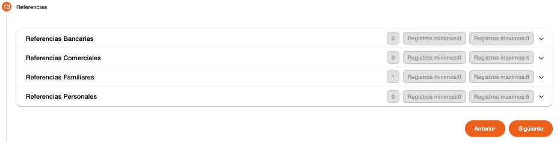

# Referencias – Persona Natural

Registro de las referencias relacionadas a la persona. La creación de los datos depende la cantidad de registros requeridas como mínimo o máximos para cada clase de referencia. No permite continuar si no es ingresada la cantidad mínima y no permite agregar más registros cuando se alcanza la cantidad máxima. 

En la sección de referencias se puede observar de forma general, la cantidad de registros existentes por cada referencia, la cantidad de registros mínima y cantidad máxima permitida por cada referencia, a excepción de las referencias SIAFI que son opcionales. 

La cantidad de registros obligatorios se determinan en base a la cantidad indicada en el campo Registros Mínimos, así también se determina la cantidad de Registros Máximos para no permitir el ingreso de más referencias. 

* [Referencias Bancarias](referencias_bancarias.md)
* [Referencias Comerciales](referencias_comerciales.md)
* [Referencias Familiares](referencias_familiares.md)
* [Referencias Personales](referencias_personales.md)

[← Volver a página anterior](crear-cliente-natural.md)

