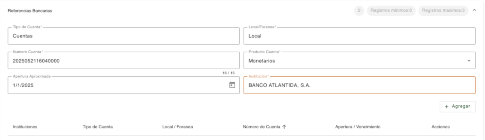

# Referencias Bancarias

Registro de las referencias bancarias de la persona, en base a los datos que se van indicado en cada campo, se habilitan los siguientes datos para completar los datos de la referencia bancaria. 

| Campo | Descripción | Condición |
| :--- | :--- | :--- |
| **Tipo de Cuenta** | Tipo de cuenta de la referencia bancaria. | Obligatorio |
| **Local/Foránea** | Indica si la cuenta es local o foránea. | Obligatorio |
| **Número Cuenta/Préstamo/Tarjeta** | Número de cuenta, préstamo o tarjeta de la referencia bancaria. Al consultar una tarjeta solo se visualizan los últimos cuatro dígitos. | Obligatorio |
| **Producto Cuenta** | Producto asignado a la referencia bancaria. | Obligatorio |
| **Monto/Límite de Crédito** | Indica el monto del préstamo o límite de crédito de tarjeta. | Obligatorio |
| **Fecha Apertura/Vencimiento** | Fecha de apertura de la cuenta/préstamo o fecha de vencimiento de la tarjeta. | Obligatorio |
| **Institución** | Institución de la referencia bancaria. | Obligatorio |

[← Volver a página anterior](referencias.md)