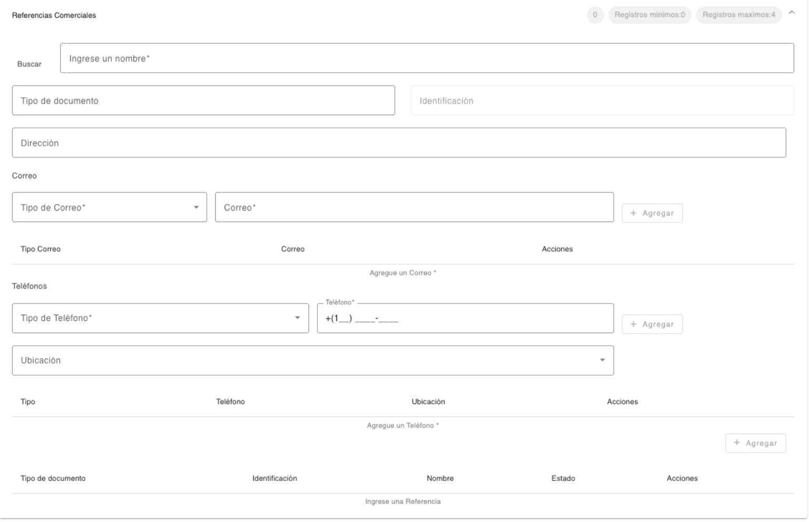

# Referencias Comerciales

Registro de las referencias comerciales de la persona. 

| Campo | Descripción | Condición |
| :--- | :--- | :--- |
| **Buscar/Nombre** | Nombre de la empresa al que corresponde la referencia comercial. El sistema hace una búsqueda del nombre ingresado y muestra una lista seleccionable de los registros de personas jurídicas encontradas, al seleccionar uno de los registros recupera de forma protegida, los datos que tiene grabados la persona jurídica en los campos correspondientes. (Identificación, dirección, correo, teléfono). Los datos que no existen, se muestra el campo habilitado para que complete la información. | Obligatorio |
| **Tipo de Documento** | Tipo de documento de identificación de la referencia comercial. | Opcional |
| **Identificación** | Número de identificación de la referencia comercial. | Obligatorio al seleccionar Tipo de Documento |
| **Dirección** | Dirección de la referencia comercial. | Opcional |

Registro de datos de contacto de la referencia comercial de la persona. Es obligatorio registrar como mínimo un correo y un teléfono. 

Es importante considerar que los datos de contacto tanto correos electrónicos como teléfonos, no deben existir registrados con otra persona. 

## Correo Electrónico

| Campo | Descripción | Condición |
| :--- | :--- | :--- |
| **Tipo de Correo** | Tipo de correo para contactar a la persona. | Obligatorio |
| **Correo** | Dirección de correo electrónico de la persona. El correo no debe existir registrado con otra persona. | Obligatorio |

## Teléfono

| Campo | Descripción | Condición |
| :--- | :--- | :--- |
| **Tipo de Teléfono** | Tipo de teléfono para contactar a la persona. | Obligatorio |
| **Teléfono** | Teléfono de la persona. El sistema sugiere el área de marcación correspondiente al país local, el cual se puede modificar. El teléfono no debe existir registrado con otra persona. | Obligatorio |
| **Ubicación** | Dirección relacionada al teléfono de la persona. Muestra un listado de direcciones registradas a la persona. | Opcional |

[← Volver a página anterior](referencias.md)