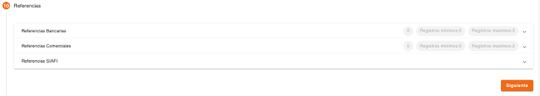
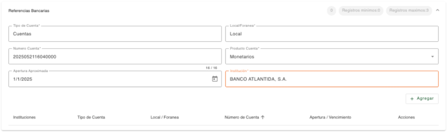
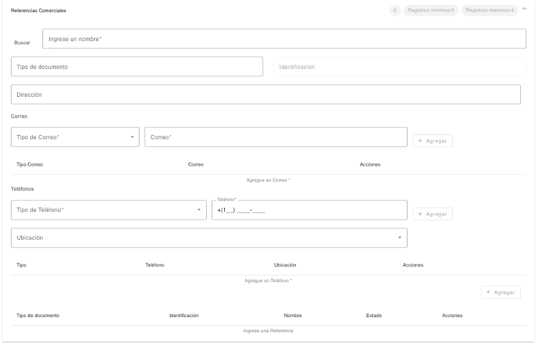
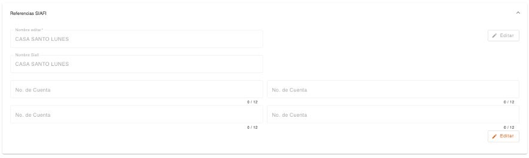

# Referencias - Persona Jurídica

Registro de las referencias relacionadas a la persona jurídica. La creación de los datos depende la cantidad de registros requeridas como mínimo o máximos para cada clase de referencia. No permite continuar si no es ingresada la cantidad mínima y no permite agregar más registros cuando se alcanza la cantidad máxima.

En la sección de referencias se puede observar de forma general, la cantidad de registros existentes por cada referencia, la cantidad de registros mínima y cantidad máxima permitida por cada referencia, a excepción de las referencias SIAFI que son opcionales.

La cantidad de registros obligatorios se determinan en base a la cantidad indicada en el campo Registros Mínimos, así también se determina la cantidad de Registros Máximos para no permitir el ingreso de más referencias.

### Referencias Bancarias

Registro de las referencias bancarias de la persona, en base a los datos que se van indicado en cada campo, se habilitan los siguientes datos para completar los datos de la referencia bancaria.

| Campo | Descripción | Condición |
| :--- | :--- | :--- |
| **Tipo de Cuenta** | Tipo de cuenta de la referencia bancaria. | Obligatorio |
| **Local/Foránea** | Indica si la cuenta es local o foránea. | Obligatorio |
| **Número Cuenta/Préstamo/Tarjeta** | Número de cuenta, préstamo o tarjeta de la referencia bancaria. Al consultar una tarjeta solo se visualizan los últimos cuatro dígitos. | Obligatorio |
| **Monto/Límite de Crédito** | Indica el monto del préstamo o límite de crédito de tarjeta. | Obligatorio |
| **Producto Cuenta** | Producto asignado a la referencia bancaria. | Obligatorio |
| **Fecha Apertura/Vencimiento** | Fecha de apertura de la cuenta/préstamo o fecha de vencimiento de la tarjeta. | Obligatorio |
| **Institución** | Institución de la referencia bancaria. | Obligatorio |

### Referencias Comerciales

Registro de las referencias comerciales de la persona jurídica.

| Campo | Descripción | Condición |
| :--- | :--- | :--- |
| **Buscar/Nombre** | Nombre de la empresa al que corresponde la referencia comercial. El sistema hace una búsqueda del nombre ingresado y muestra una lista seleccionable de los registros de personas jurídicas encontradas, al seleccionar uno de los registros recupera de forma protegida, los datos que tiene grabados la persona jurídica en los campos correspondientes. (Identificación, dirección, correo, teléfono). Los datos que no existen, se muestra el campo habilitado para que complete la información. | Obligatorio |
| **Tipo de Documento** | Tipo de documento de identificación de la referencia comercial. | Opcional |
| **Identificación** | Número de identificación de la referencia comercial. | Obligatorio al seleccionar Tipo de Documento |
| **Dirección** | Dirección de la referencia comercial. | Opcional |

Registro de datos de contacto de la referencia comercial de la persona. Es obligatorio registrar como mínimo un correo y un teléfono.

Es importante considerar que los datos de contacto tanto correos electrónicos como teléfonos, no deben existir registrados con otra persona.

| Campo | Descripción | Condición |
| :--- | :--- | :--- |
| **Tipo de Correo** | Tipo de correo para contactar a la persona. | Obligatorio |
| **Correo** | Dirección de correo electrónico de la persona. El correo no debe existir registrado con otra persona. | Obligatorio |

| Campo | Descripción | Condición |
| :--- | :--- | :--- |
| **Tipo de Teléfono** | Tipo de teléfono para contactar a la persona. | Obligatorio |
| **Teléfono** | Teléfono de la persona. El sistema sugiere el área de marcación correspondiente al país local, el cual se puede modificar. El teléfono no debe existir registrado con otra persona. | Obligatorio |
| **Ubicación** | Dirección relacionada al teléfono de la persona. Muestra un listado de direcciones registradas a la persona. | Opcional |

### Referencias SIAFI

Registro de las referencias SIAFI de la persona jurídica. Solo se permite el registro de cuatro números de cuenta, esta información es opcional. El sistema valida que la cuenta exista en el sistema de administración financiera (SIAFI).

| Campo | Descripción | Condición |
| :--- | :--- | :--- |
| **Nombre Editar** | Nombre con el que la persona. El campo se puede editar para que sea actualizado en el campo Nombre SIAFI. | Opcional |
| **Nombre SIAFI** | Nombre con el que la persona tiene registrada la cuenta SIAFI. | Protegido |
| **No. De Cuenta** | Primer número de cuenta SIAFI. | Opcional |
| **No. De Cuenta** | Segundo número de cuenta SIAFI. | Opcional |
| **No. De Cuenta** | Tercer número de cuenta SIAFI. | Opcional |
| **No. De Cuenta** | Cuarto número de cuenta SIAFI. | Opcional |

[← Volver a página anterior](crear-cliente-juridica.md)

