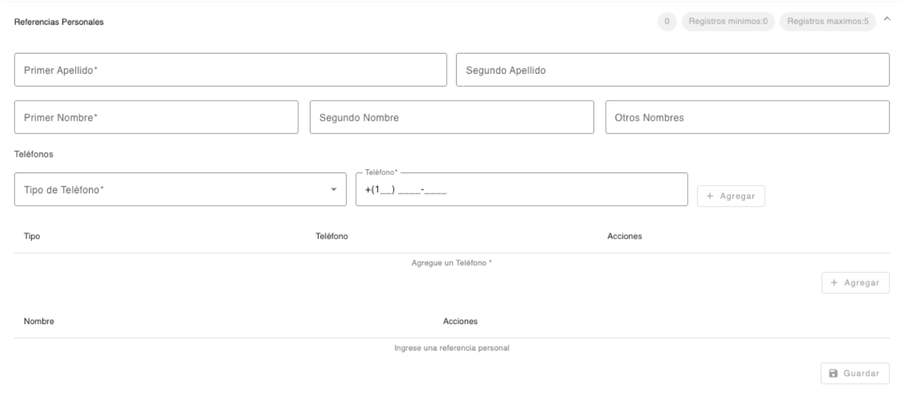

# Referencias Personales

Registro de las referencias personales de la persona.  

| Campo | Descripción | Condición |
| :--- | :--- | :--- |
| **Primer Apellido** | Primer apellido de la persona. | Obligatorio |
| **Segundo Apellido** | Segundo apellido de la persona. | Opcional |
| **Primer Nombre** | Primer nombre de la persona. | Obligatorio |
| **Segundo Nombre** | Segundo nombre de la persona. | Opcional |
| **Otros Nombres** | Otros nombres de la persona. | Opcional |

Registro de teléfonos de contacto de la referencia personal. Es obligatorio registrar como mínimo un teléfono. El número de teléfono no debe existir registrado con otra persona. 

| Campo | Descripción | Condición |
| :--- | :--- | :--- |
| **Tipo de Teléfono** | Tipo de teléfono para contactar a la persona. | Obligatorio |
| **Teléfono** | Teléfono de la persona. El sistema sugiere el área de marcación correspondiente al país local, el cual se puede modificar. El teléfono no debe existir registrado con otra persona. | Obligatorio |

[← Volver a página anterior](referencias.md)