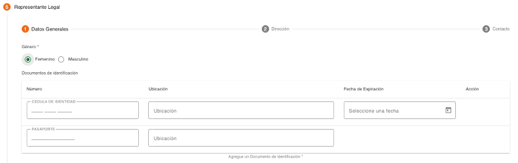
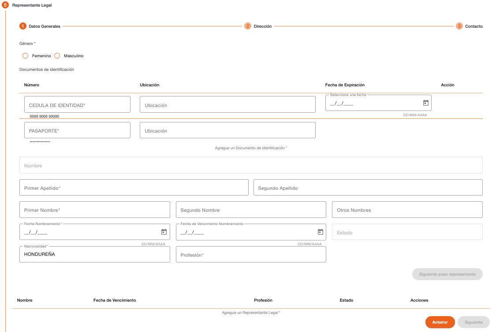
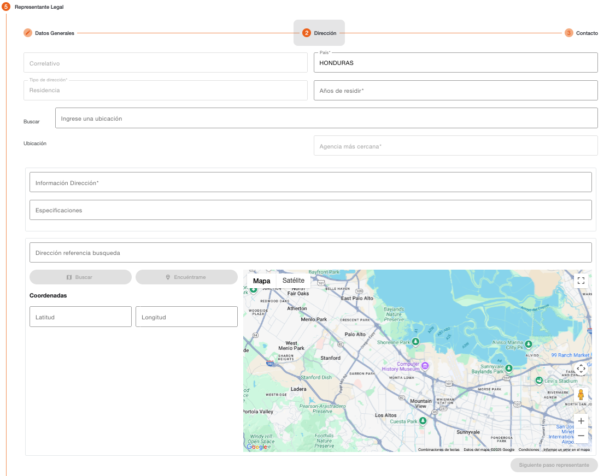
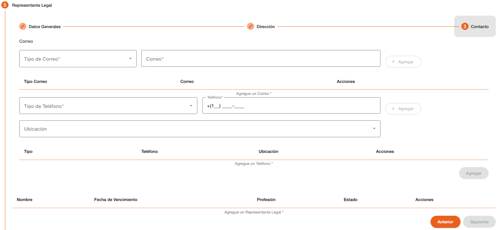
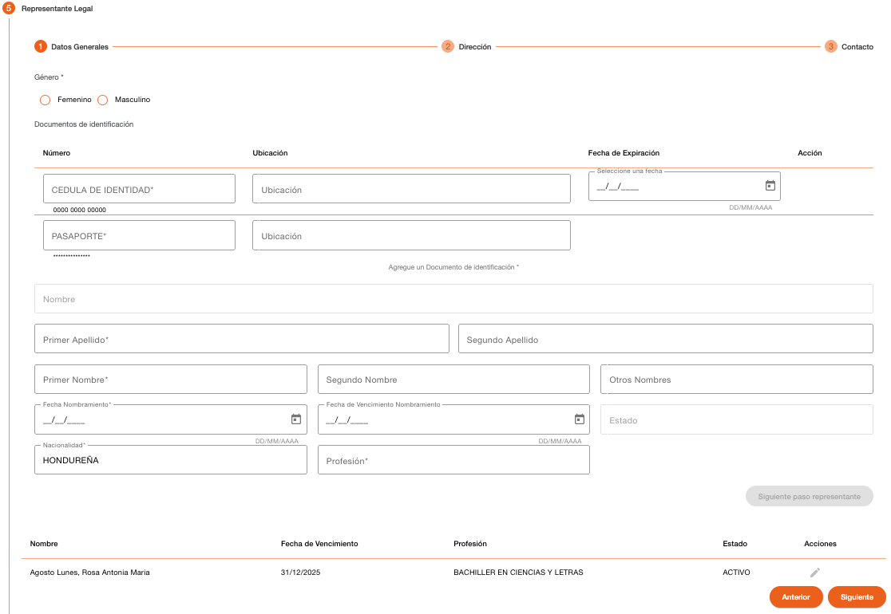

# Representante Legal - Persona Jurídica

Registro del representante legal de la persona jurídica, esta sección es obligatoria, solo puede existir un representante legal activo.

Se debe considerar que en base al documento de identificación el sistema valida si la persona ya existe en el sistema, si la persona existe, recupera los datos de la persona mostrándolos protegidos, solo los datos que no existen se muestran habilitados para completar la información requerida.

La creación del representante legal se divide en tres pasos, que son datos generales, dirección y contacto.

### Representante Legal – Datos Generales

Permite capturar la información general del representante legal de la persona jurídica, el primer campo que se debe indicar es el género. (Femenino/Masculino) Después de este campo, es requerido el ingreso de documentos de identificación de la persona.

Del listado de tipos de documentos mostrado, hay algunos que son requeridos y otros son opcionales, esto depende de cómo están definidos los parámetros de tipos de documentos por rol de persona “REP_LEGAL”. 

Es necesario el ingreso de por lo menos un documento de identificación, si no se ingresan los datos de documentos de identificación requeridos, el sistema muestra un dialogo de solicitud de credenciales, para autorizar la continuidad del flujo, sin haber ingresado el tipo de documento requerido. 

Los datos requeridos por tipo de documento de identificación pueden ser número de identificación, ubicación y fecha de expiración.

| Campo | Descripción | Condición |
| :--- | :--- | :--- |
| **Número** | Número de identificación de la persona, el campo valida que sea ingresado en el formato configurado para el tipo de documento. En base a este número de identificación el sistema puede recuperar datos que son validados en los parámetros de ubicaciones geográficas o validar el año de nacimiento. Es necesario ingresar al menos un documento de identificación. | Es necesario ingresar al menos un documento de identificación. |
| **Ubicación** | No todos los documentos pueden requerir este dato, solo si el tipo de documento de identificación tiene configurado que requiere ubicación, será mostrado este campo. Permite indicar el lugar en donde fue emitido el documento de identificación. Dependiendo de la configuración del tipo de documento puede recuperar estos datos de forma automática del número de identificación y proteger los datos de este campo para que no sean modificados. | Obligatorio si es ingresado el número de identificación. |
| **Fecha de Expiración** | No todos los documentos pueden requerir este dato, solo si el tipo de documento de identificación tiene configurado que requiere fecha de expiración, será mostrado este campo. Permite indicar la fecha en la que expira el documento de identificación. La fecha no puede ser menor a la fecha actual. | Obligatorio si es ingresado el número de identificación. |

El sistema realiza validaciones de lista de cautela por documento de identificación y muestra los mensajes correspondientes si encuentra la identificación en alguna lista de cautela (Notificación, Solicitar Autorización, Detener). 

Es necesario ingresar por lo menos los datos de un tipo de documento para habilitar el botón Siguiente.

#### Mensajes de Error

| Mensaje | Descripción |
| :--- | :--- |
| **La entrada está incompleta** | No ha sido ingresada la información completamente conforme al formato esperado de la identificación. |
| **Ubicación requerida** | Debe seleccionar de la lista seleccionable, el lugar de emisión del documento de identificación. |
| **Persona existente** | Indica que la persona fue encontrada en base al número de documento de identificación. |

Al indicar los datos de un documento de identificación de una persona que ya existe en el sistema, serán recuperados los datos que tiene registrados los cuales se mostrarán protegidos en los siguientes pasos, solo se muestran habilitados los campos de información que no tiene grabada la persona.

Después de ingresar los datos de identificaciones, es requerido el ingreso de la información general de la persona.

| Campo | Descripción | Condición |
| :--- | :--- | :--- |
| **Género** | Indica si la persona es de género masculino o femenino. | Obligatorio |
| **Primer Apellido** | Primer apellido de la persona. | Obligatorio |
| **Segundo Apellido** | Segundo apellido de la persona. | Opcional |
| **Primer Nombre** | Primer nombre de la persona. | Obligatorio |
| **Segundo Nombre** | Segundo nombre de la persona. | Opcional |
| **Otros Nombres** | Otros nombres de la persona. | Opcional |
| **Fecha de Nombramiento** | Fecha en que fue nombrada la persona como representante legal. | Obligatorio |
| **Fecha de Vencimiento de Nombramiento** | Fecha en que vence el nombramiento de la persona como representante legal. | Opcional |
| **Estado** | Indica el estado del representante legal, por defecto es activo. Al darle de baja es inactivo. | Protegido |
| **Nacionalidad** | Nacionalidad que indica el documento de identificación de la persona. | Obligatorio |
| **Profesión** | Profesión de la persona. | Obligatorio |
| **Fecha de Profesión** | Fecha de inicio de profesión. Este campo es mostrado solo si la profesión tiene configurado que requiere fecha. | Obligatorio |

### Representante Legal – Dirección

Permite registrar la información de la dirección en la que reside el representante legal.

| Campo | Descripción | Condición |
| :--- | :--- | :--- |
| **Correlativo** | Correlativo de la dirección. | Protegido |
| **País** | País al que corresponde la dirección. | Obligatorio |
| **Tipo de Dirección** | Tipo de dirección registrada, en base a la cual se determina los datos que se deben ingresar al registrar la dirección. | Protegido |
| **Años de Residir** | Cantidad de años de residir en esa dirección. | Obligatorio |
| **Buscar** | Buscador de distribución geográfica configurada para el país, se debe ingresar el texto a buscar, el sistema muestra una lista de registros coincidentes. Al seleccionar el registro, muestra los datos recuperados en el campo ubicación, agencia, información dirección y dirección referencia de búsqueda. | Obligatorio |
| **Ubicación** | Muestra los niveles geográficos recuperados en base al registro seleccionado en campo Buscar. | Protegido |
| **Agencia más Cercana** | Muestra la agencia más cercana recuperada en base al registro seleccionado en campo Buscar. | Protegido |
| **Información Dirección** | Información detallada de la dirección. | Obligatorio |
| **Especificaciones** | Información de referencias para ubicar la dirección. | Opcional |
| **Dirección Referencia Búsqueda** | Información detallada de la dirección que se puede utilizar para realizar la búsqueda de geoposición con el servicio de mapas utilizando el botón Buscar, para recuperar la latitud y longitud de la dirección. | Opcional |
| **Latitud** | Datos de latitud en donde se ubica la dirección. | Opcional |
| **Longitud** | Datos de longitud en donde se ubica la dirección. | Opcional |

| Botón | Descripción |
| :--- | :--- |
| **Buscar** | Recupera las coordenadas en las que está localizada la dirección por medio del servicio de mapas |
| **Encuéntrame** | Recupera en el mapa la ubicación más cercana a donde se encuentra ubicado el equipo de donde se invoque el servicio y actualiza los datos de coordenadas. |

### Representante Legal – Contacto

Registro de datos de contacto del representante legal. Es obligatorio registrar como mínimo un correo y un teléfono.

Es importante considerar que los datos de contacto, tanto correos electrónicos como teléfonos, no deben existir registrados con otra persona.

| Campo | Descripción | Condición |
| :--- | :--- | :--- |
| **Tipo de Correo** | Tipo de correo para contactar a la persona. | Obligatorio |
| **Correo** | Dirección de correo electrónico de la persona. El correo no debe existir registrado con otra persona. | Obligatorio |

| Campo | Descripción | Condición |
| :--- | :--- | :--- |
| **Tipo de Teléfono** | Tipo de teléfono para contactar a la persona. | Obligatorio |
| **Teléfono** | Teléfono de la persona. El sistema sugiere el área de marcación correspondiente al país local, el cual se puede modificar. El teléfono no debe existir registrado con otra persona. | Obligatorio |
| **Ubicación** | Dirección relacionada al teléfono de la persona. Muestra un listado de direcciones registradas a la persona. | Opcional |

Después de agregar el representante legal se muestra el registro creado en el grid.

[← Volver a página anterior](crear-cliente-juridica.md)