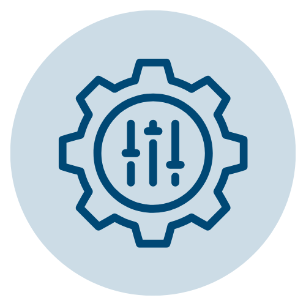

<h1>Base conocimiento QA</h1>

Documentación completa de la plataforma para el equipo de Quality Assurance

  <figure>
    
    <figcaption>Estándares</figcaption>
  </figure>
  

    
Guías y estándares de calidad para el desarrollo y testing

  

  <figure>
    
    <figcaption>Configuraciones</figcaption>
  </figure>
  

    
Configuración del sistema y parámetros de la plataforma

  

  <figure>
    
    <figcaption>Autorizaciones</figcaption>
  </figure>
  

    
Sistema de permisos y autorizaciones de usuarios

  

  <figure>
    
    <figcaption>Búsqueda de Cliente</figcaption>
  </figure>
  

    
Procedimientos para búsqueda y consulta de clientes

  

  <figure>
    
    <figcaption>Crear Cliente</figcaption>
  </figure>
  

    
Flujos para creación de nuevos clientes en el sistema

  

  <figure>
    
    <figcaption>Administrar Persona</figcaption>
  </figure>
  

    
Gestión de información personal en la plataforma

  

<a href="#" onclick="history.back(); return false;">← Volver a Página Anterior</a>

